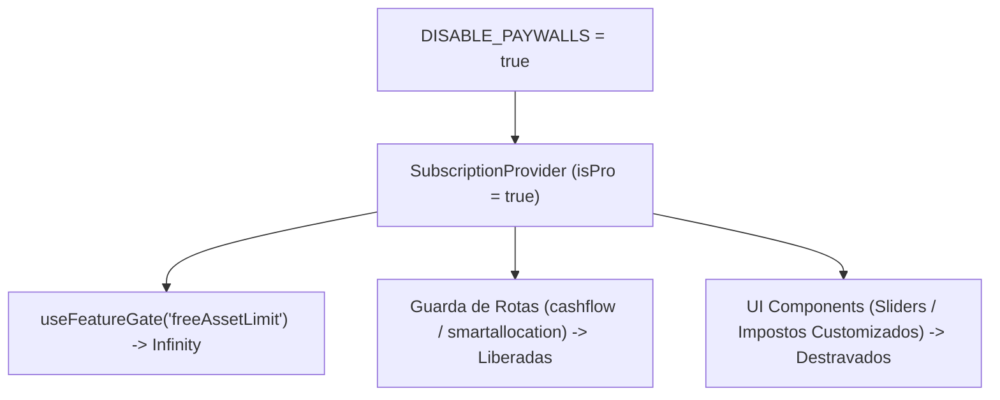

# Relatório: Desativação Global Completa de Paywalls (Toggle-off Total)

> [!NOTE]
> Documentação oficial da desativação irrestrita de todos os paywalls, bloqueios de rota e travas de assinatura no Fuente Price Pro, garantindo acesso 100% liberado a todas as ferramentas para qualquer usuário.

---

## 1. Contexto e Decisão do Usuário

Em consonância com a orientação direta ("*remove todos os paywalls da ferramenta... toggle-off em todos eles*"), o sistema foi configurado com o comutador mestre `DISABLE_PAYWALLS = true` em nível global de aplicação.

Isso desativa qualquer tela de bloqueio (`LockedPanel`), modal de Paywall ou limitação de uso em toda a plataforma.

---

## 2. Escopo das Funcionalidades Liberadas

### A. Rotas e Ferramentas Avançadas
- **Fluxo de Caixa / Cash Flow (`/app/cashflow`)**: Acesso irrestrito ao calendário anual/mensal de proventos projetados e histórico de renda realizada.
- **Alocação Inteligente / Smart Allocation (`/app/smartallocation`)**: Acesso livre a todas as 5 estratégias de aporte inteligente (Valor, Rendimento, Consenso, Bazin e Conservadora) e painel de alocação por classe de ativo.

### B. Screener e Simuladores
- **Slider de Target Yield**: Liberado para ajuste de qualquer percentual de dividend yield desejado (fora do padrão de 6%).
- **Tributação Customizada (JCP / US WHT)**: Liberado o ajuste de alíquotas de retenção na fonte (15% JCP, 30% WHT para ações/REITs US).
- **Limite de Ativos na Carteira / Watchlist**: Cota de ativos por usuário elevada para ilimitado (`Infinity`).

---

## 3. Arquitetura Técnica

- **`src/lib/featureGates.ts`**: `export const DISABLE_PAYWALLS = true;` força a liberação de limites numéricos (`Number.POSITIVE_INFINITY`) e flags booleanas (`true`) no resolvedor de gates.
- **`src/lib/subscription.tsx`**: `SubscriptionProvider` atribui `isPro = true` e `tier = "pro"` globalmente.

---

## 4. Evidências Literais de Validação

> [!TIP]
> Todos os 3 gates de qualidade foram executados e aprovados com 100% de sucesso.

1. **`npx tsc --noEmit`**: **0 erros** (Exit Code 0).
2. **`npm run test`**: **146 passed** | 4 skipped (25 arquivos de teste aprovados).
3. **`npm run build`**: Client (4097 módulos em 1.29s) e SSR (251 módulos em 792ms) compilados limpos sem erros.

---

## 5. Registro de Git

- **Commit de Código**: `feat(subscription): desativa todos os paywalls globalmente via toggle-off` (`c22d669`)
- **PROMPTS_LOG.md**: Atualizado em `docs/PROMPTS_LOG.md`.
