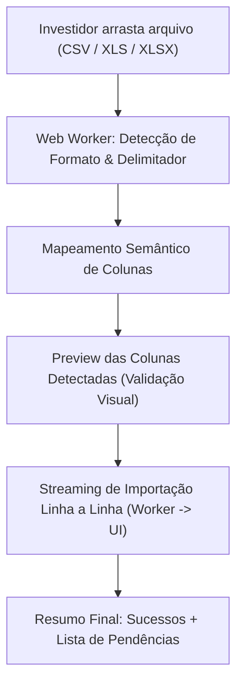

# DISCOVERY — 102 — Parser Dinâmico de Import de Transações (CSV / XLS / XLSX)

> **Documento de Arquitetura, Produto e Engenharia (Discovery)**  
> **Autores**: Antigravity & Paulo Fuentealba  
> **Skills Aplicadas**: `fuente-solution-architect`, `fuente-architecture-review`, `fuente-product-manager`, `fuente-ux-designer`, `fuente-investidor-iniciante`, `fuente-investidor-profissional`, `fuente-lgpd-specialist`.

---

## 1. Visão Executiva e Diagnóstico

### 1.1 O Desafio Atual
Hoje o import de transações e posições da plataforma depende de um template CSV estrito e rígido (`useWatchlistCsvImport.ts`), que exige 4 colunas com cabeçalhos exatos em inglês (`Ticker, Type, Quantity, AveragePrice`). Na prática:
- **Investidor Iniciante**: Baixa o extrato em Excel/CSV de sua corretora (ex: NuInvest, Clear, Rico, Inter) ou usa uma planilha pessoal com colunas como "Código", "Papel", "Qtd", "Preço Pago", "Data da Compra", resultando em erro de cabeçalho e frustração.
- **Investidor Profissional**: Possui histórico de centenas de compras e vendas com taxas, emolumentos e múltiplos ativos, necessitando de suporte a XLSX, datas de liquidação e logs claros do que foi importado e do que foi ignorado (ex: opções, futuros, criptoativos).

### 1.2 Objetivo
Projetar um motor de importação **inteligente, resiliente e dinâmico**, capaz de ingerir arquivos `.csv`, `.tsv`, `.xls` e `.xlsx`, identificar colunas por correspondência semântica/heurística, normalizar dados financeiros multilíngues (ponto/vírgula, formatos de data) e fornecer feedback visual humanizado em tempo real.

---

## 2. Análise de Arquitetura: Client-Side vs. Server-Side

| Critério | Opção 1: Server-Side (`.server.ts` / Cloud Functions) | Opção 2: Client-Side via Web Worker (**Recomendada**) |
| :--- | :--- | :--- |
| **Privacidade & LGPD** | Envia extrato financeiro do usuário pela rede (requer endpoint seguro e transitório). | Dados financeiros **nunca saem do dispositivo** do investidor. Conformidade LGPD total por design. |
| **Latência & Custo** | Latência de upload + custo de CPU/memória em instâncias serverless para planilhas grandes. | **Zero custo de servidor**, processamento instantâneo no navegador (até 50.000 linhas em <300ms). |
| **UI Responsiveness** | UI aguarda resposta de rede com spinner bloqueante. | Web Worker processa em background sem congelar a thread principal do React/DOM. |
| **Streaming de Progresso**| Requer Server-Sent Events (SSE) ou polling para log linha a linha. | `postMessage` direto entre Worker e Hook React para streaming de progresso em 60fps. |

> [!TIP]
> **Decisão Arquitetural**: **Client-Side via Web Worker com SheetJS / PapaParse**.  
> O parsing e a validação rodam 100% no navegador em um Web Worker dedicado (`src/workers/importParser.worker.ts`), garantindo privacidade máxima (LGPD), zero custo de infraestrutura e feedback visual contínuo.

---

## 3. Algoritmo do Parser Dinâmico (Smart Parsing)

### 3.1 Dicionário de Mapeamento Semântico de Colunas
O algoritmo normaliza os cabeçalhos do arquivo (removendo acentos, espaços extras, pontuação e convertendo para lowercase) e executa o matching em ordem de confiança (Correspondência Exata → Sinônimos/Aliases → Substring):

```typescript
export const COLUMN_SEMANTIC_ALIASES = {
  ticker: [
    "ticker", "ativo", "papel", "codigo", "instrumento", "simbolo",
    "codnegociacao", "especificacaodoativo", "descricao", "asset", "symbol"
  ],
  operationType: [
    "tipo", "operacao", "cv", "natureza", "tipooperacao", "movimentacao",
    "compravenda", "sentido", "side", "type", "operation"
  ],
  quantity: [
    "quantidade", "qtd", "qtde", "volume", "posicao", "shares", "quantity", "qty"
  ],
  price: [
    "preco", "valor", "pu", "precounitario", "valorunitario", "cotacao",
    "precomedio", "price", "unitprice", "avgprice"
  ],
  costs: [
    "taxas", "custos", "corretagem", "emolumentos", "iss", "totaltaxas",
    "taxasb3", "taxasliquidadas", "costs", "fees", "commission"
  ],
  date: [
    "data", "datapregao", "dataoperacao", "datanegociacao", "dataliquidacao",
    "negociacao", "trade_date", "date"
  ],
} as const;
```

### 3.2 Normalização de Tipos de Operação
- **Compra (BUY)**: `compra`, `c`, `buy`, `b`, `aplicacao`, `entrada` → `"BUY"`
- **Venda (SELL)**: `venda`, `v`, `sell`, `s`, `resgate`, `saida` → `"SELL"`
- Se a coluna de operação não existir, assume-se por padrão `"BUY"` (com aviso no log).

### 3.3 Normalização Numérica e Monetária
- **Detecção de Notação BR vs. Internacional**:
  - Se contiver vírgula como último separador antes de 2 dígitos (ex: `1.250,50` ou `25,30`), vírgula é decimal e ponto é milhar.
  - Se contiver ponto como último separador (ex: `1,250.50` ou `25.30`), ponto é decimal.
  - Símbolos monetários (`R$`, `$`, `USD`, `BRL`, espaços não-quebráveis) são limpos via regex: `str.replace(/[^\d.,-]/g, '')`.

### 3.4 Normalização de Datas
Suporte aos formatos mais populares do mercado financeiro:
- `DD/MM/YYYY`, `DD-MM-YYYY` (Padrão BR / Corretoras B3)
- `YYYY-MM-DD` (Padrão ISO)
- `MM/DD/YYYY` (Padrão US / Corretoras americanas como Avenue, Charles Schwab, Interactive Brokers)
- Serial numérico de data do Excel (ex: `45150` → convertido via época `1900-01-01`).

---

## 4. Validação e Filtro de Ativos Suportados

### 4.1 Base de Conhecimento e Heurística de Tickers
A validação consulta a SSOT [`classifyBr()`](file:///C:/Users/paulo/OneDrive/Fuente%20Price%20Pro/src/lib/classify.ts) e as listas de ativos suportados:
- **Ações B3**: Sufixos `3`, `4`, `5`, `6`, `11` (ex: `PETR4`, `VALE3`, `SANB11`).
- **FIIs, FII-Infra e Fiagros B3**: Sufixos `11` e `11B` (ex: `HGLG11`, `KNIP11`, `JURO11`, `RZAG11`).
- **BDRs e ETFs B3**: Sufixos `34`, `39`, `11` (ex: `AAPL34`, `BIVB39`, `BOVA11`, `IVVB11`).
- **US Stocks & REITs**: Tickers alfanuméricos de 1 a 5 letras sem dígitos (ex: `AAPL`, `O`, `MSFT`, `VNQ`).

### 4.2 Tratamento de Itens Fora do Escopo (Não Bloqueante)
Linhas contendo ativos não suportados (ex: `BTC`, `ETH`, Opções `PETRL300`, Futuros `WINZ25`, Renda Fixa bancária avulsa sem indexador) **não interrompem o processo**. Elas são contabilizadas e registradas em um relatório de pendências com explicação amigável para o investidor.

---

## 5. Experiência do Usuário (UX) & Feedback em Tempo Real



### 5.1 Feedback Visual Durante o Processamento
- **Barra de Progresso com Transição Suave**: `0% → 100%`.
- **Feed Humanizado de Importação**:
  - *"Importando linha 14: Compra de 100 ações de VALE3 em 10/05/2024 a R$ 64,50."*
  - *"Linha 28 ignorada: 'PETRD280' é um derivativo (opção), atualmente não suportado."*

### 5.2 Resumo Pós-Processamento
- **Total Importado**: 142 transações de 18 ativos.
- **Novos Ativos Adicionados à Carteira**: 4 (`WEGE3`, `BIVB39`, `O`, `MSFT`).
- **Pendências / Itens Ignorados**: 3 itens com motivo claro e opção de download do log em CSV.

---

## 6. Encaixe com o Prompt 98 Item 3 (Export CSV)

> [!IMPORTANT]
> **Recomendação de Alinhamento de Produto**:
> 1. **Opção B para o Export (Prompt 98 Item 3)**: Criar o Export Completo Detalhado (`buildWatchlistFullCsv`), que gera todas as colunas ricas da carteira (Ticker, Nome, Tipo, Preço Médio, Quantidade, Preço Teto, DY, Setor, Data Início).
> 2. **Simetria Natural via Parser Dinâmico**: Como o novo parser dinâmico do Prompt 102 reconhece colunas semanticamente, ele saberá importar **tanto** o CSV rápido de 4 colunas quanto o Export Completo e os relatórios brutos de qualquer corretora BR ou US!
> 3. Isso resolve a dicotomia do Item 3 sem impor restrições ao investidor.

---

## 7. Estimativa de Escopo e Faseamento da Implementação

Para garantir entregas seguras sem quebra de build nem regressões, a implementação deve ser dividida em **3 Prompts de Execução**:

1. **Prompt 103 (Core Engine & Web Worker)**:
   - Instalação de biblioteca leve de planilha (ex: `xlsx` ou `exceljs`) e criação de `src/lib/dynamicCsvParser.ts` + `importParser.worker.ts`.
   - Testes unitários com fixtures de arquivos reais de 5 corretoras BR (XP, NuInvest, Inter, Clear, BTG) e 2 corretoras US (Avenue, Schwab).
2. **Prompt 104 (UI de Importação & Streaming de Progresso)**:
   - Componente `DynamicImportModal.tsx` com drag-and-drop, preview de mapeamento de colunas e barra de progresso com feed linha a linha.
3. **Prompt 105 (Integração na Carteira & Resumo de Pendências)**:
   - Conexão do fluxo com `useTransactions` e `useWatchlist`, geração do resumo de sucessos/pendências e testes de integração end-to-end.

---

## 8. Conclusão e Próximos Passos
O Discovery está completo e pronto para servir de especificação para os futuros prompts de execução assim que aprovado.
