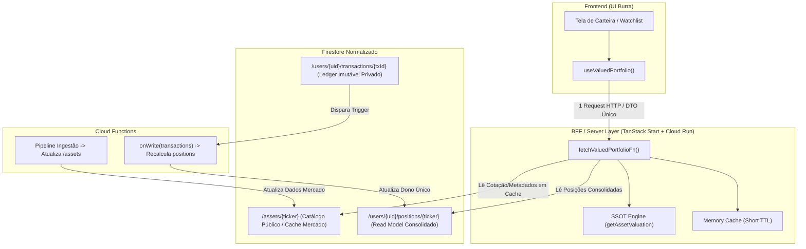
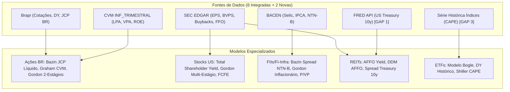

# Discovery Arquitetural & Plano de Ação Detalhado
## Fuente Price Pro — (1) BFF / Camada de Domínio & (2) Preço-Teto Especializado por Classe de Ativo

> **Tipo de Entrega**: Discovery & Plano de Ação Estratégico (Modo Read-Only — Nenhuma alteração de código aplicada nesta rodada).  
> **Data**: 15/08/2026  
> **Branch Auditada**: `dev`  
> **Conformidade**: 100% alinhado às 9 regras de ouro do [`AGENTS.md`](file:///C:/Users/paulo/OneDrive/Fuente%20Price%20Pro/docs/AGENTS.md).

---

## 1. Declaração de Governança de Roles (`AGENTS.md` — Regra 9)

| Role | Status | Atuação no Discovery |
| :--- | :---: | :--- |
| **`fuente-solution-architect`** | ✅ **Ativo** | Desenho do BFF em Cloud Run, normalização de coleções Firestore (`/assets`, `/positions`, `/transactions`), conciliação de cache (BFF ↔ TanStack Query) e dispatcher de valuation no SSOT. |
| **`fuente-architecture-review`** | ✅ **Ativo** | Gate mestre de integridade arquitetural, prevenção de duplicação de fórmulas (Regra 4) e conformidade dos DTOs com tipagem estrita (Regra 1 / Regra 2). |
| **`fuente-business-architect`** | ✅ **Ativo** | Definição da capacidade de negócio "Posição Consolidada" como read model derivado e especificação dos fluxos de precificação por classe de ativo. |
| **`fuente-investidor-profissional`** | ✅ **Ativo** | Validação de credibilidade institucional dos modelos de valuation (Spread NTN-B, AFFO Yield, Shiller PE, Bogle, Shareholder Yield, Gordon 2 Estágios) e exigência de transparência nos inputs (eliminação de "números mágicos"). |
| **`fuente-investidor-iniciante`** | ✅ **Ativo** | Definição dos modos "Simples" (presets Conservador/Moderado/Arrojado) e tradução de jargões técnicos para linguagem de resultado ("Retorno mínimo que você exige" em vez de "Taxa k"). |
| **`fuente-product-manager`** | ✅ **Ativo** | Priorização e sequenciamento dos épicos (Fases 0 a 4 para o BFF e Fases 2.0 a 2.6 para o Épico 2 - Intelligence). |
| **`fuente-ux-designer`** | ✅ **Ativo** | Diretrizes do frontend "burro" para o Modo Avançado (sliders, badges de confiança `●●●○`, debounce e feedback com skeletons). |
| **`fuente-advogado-lgpd-gdpr`** | ✅ **Ativo** | Garantia de minimização de dados no DTO privado, segregação de catálogo público e conformidade com LGPD Art. 6º e 18. |
| **`fuente-product-marketing`** | ✅ **Ativo** | Posicionamento do Preço-Teto Calibrado por Classe e Consenso Multi-Ativo como o diferencial competitivo central (*moat*) contra StatusInvest e Investidor10. |

---

# PARTE I — Discovery: Arquitetura de Dados & Camada de Integração (BFF)

## 2. Diagnóstico da Arquitetura Atual no Repositório

### 2.1 O Problema do "Frontend como Integrador"
Hoje, o hook central de carteira ([`useValuedPortfolio.tsx`](file:///C:/Users/paulo/OneDrive/Fuente%20Price%20Pro/src/lib/useValuedPortfolio.tsx)) atua como um agregador síncrono no dispositivo do usuário:
1. Dispara `useWatchlist()` (leitura de todos os itens do usuário no Firestore).
2. Dispara `useTransactions()` (leitura do histórico bruto de transações no Firestore).
3. Recomputa no cliente a quantidade e o preço médio ponderado (`recalculateHoldingFromTransactions`).
4. Dispara `useLiveQuotesAndMeta(baseItems)` (busca em lote de cotações e metadados).
5. Dispara `useSelic()`, `exchangeRateQueryOptions()`, `macroRatesQueryOptions()` e `ipcaFiveYearAverageQueryOptions()` (4 queries adicionais no cliente).
6. Itera sobre cada ativo executando [`getAssetValuation`](file:///C:/Users/paulo/OneDrive/Fuente%20Price%20Pro/src/lib/calculations.ts#L316) no navegador.

### 2.2 Consequências Técnicas & Financeiras
- **Chatty I/O no Mobile**: O cliente dispara até 7 chamadas assíncronas concorrentes antes do primeiro paint consistente. Em redes 4G/3G de alta latência, isso gera *layout shift* e atraso perceptível de renderização.
- **Custo de Leitura no Firestore**: Sem cache centralizado de ativos, cada usuário que abre a carteira com `PETR4` ou `BBSE3` provoca leituras repetidas dos mesmos dados fundamentais e cotações.
- **Vazamento de Orquestração**: A regra de *como* juntar posição + cotação + câmbio + valuation vive no estado do React, em vez de residir na camada de domínio do servidor.

---

## 3. Arquitetura Alvo: Normalização Firestore + BFF Leve



### 3.1 As Três Coleções do Firestore
1. **`/assets/{ticker}` (Catálogo Público & SSOT de Mercado)**:
   - Contém cotações, dividendos dos últimos 5 anos, EPS, BVPS, ROE, FFO, setor e metadados.
   - Alimentado pelo pipeline de ingestão das 8 fontes já integradas (`brapi`, `yahoo`, `nasdaq`, `secEdgar`, `cvm`, `bcb`).
   - Leitura pública via BFF, com cobrança no Firestore escalando por `ativos distintos`, não por `usuários`.
2. **`/users/{uid}/transactions/{txId}` (Ledger Privado Imutável)**:
   - Histórico cronológico de compras, vendas e proventos. Permanece intacto como a fonte primária da verdade de custódia.
3. **`/users/{uid}/positions/{ticker}` (Read Model Consolidado)**:
   - Documento contendo `quantity`, `averageCost`, `totalInvested`, `firstBuyDate`, `lastBuyDate`.
   - **Regra de Ouro**: Dono único de escrita (Cloud Function `onWrite` em transactions ou rotina transacional no BFF). O cliente **nunca** escreve diretamente em `positions`.

### 3.2 O Contrato DTO: `ValuedPortfolioDTO`

```typescript
export interface ValuedPortfolioDTO {
  userId: string;
  generatedAt: string;          // ISO 8601
  baseCurrency: "BRL" | "USD";  // Moeda ativa do usuário
  totalValue: MoneyDTO;
  totalInvested: MoneyDTO;
  totalYieldOnCost: number;     // Percentual consolidado
  positions: ValuedPositionDTO[];
  exchangeRate: {
    pair: "USDBRL";
    rate: number;
    asOf: string;
  };
}

export interface ValuedPositionDTO {
  ticker: string;
  assetClass: "STOCK_BR" | "FII" | "STOCK_US" | "REIT" | "ETF" | "FIXED_INCOME";
  quantity: number;
  averageCost: MoneyDTO;
  currentPrice: MoneyDTO;
  marketValue: MoneyDTO;
  valuation: {
    consensus: number | null;
    bazin: number | null;
    graham: number | null;
    gordon: number | null;
  };
  isSimulationScenario: false; // Regra 4: Simulação nunca consome este DTO salvo
}

export interface MoneyDTO {
  amountCents: number; // Em centavos para eliminar erros de ponto flutuante
  currency: "BRL" | "USD";
}
```

---

## 4. Plano de Ação: Migração em 5 Fases (Zero Big-Bang)

| Fase | Título | Ações Principais | Critério de Aceite / Não-Regressão |
| :---: | :--- | :--- | :--- |
| **Fase 0** | **ADR Formal + Baseline** | Criar `docs/architecture/adrs/ADR-001-bff-e-normalizacao-firestore.md`. Mapear volume atual de leituras e latências via logs. | Nenhum código de produção alterado. |
| **Fase 1** | **Cache `/assets`** | Criar serviço de cache `/assets/{ticker}` servido pelo servidor, mantendo fallback síncrono para as APIs externas. | O cliente continua usando o mesmo contrato; latência de cotações cai para < 50ms em cache hit. |
| **Fase 2** | **Read Model `/positions`** | Implementar Cloud Function transacional `syncPositionOnTransactionWrite` com recálculo idempotente de preço médio e quantidade. | Teste de reconciliação em paralelo: Posição no Firestore == Posição calculada em memória (0 divergências em 1.000 transações). |
| **Fase 3** | **BFF `fetchValuedPortfolioFn`** | Implementar a server function que une `positions` + `assets` + câmbio e retorna `ValuedPortfolioDTO`. Chavear via Feature Gate. | Usuários com feature flag ativa visualizam a carteira idêntica à versão client-side. |
| **Fase 4** | **Desligamento Legado** | Remover o merge pesado do cliente e migrar `useValuedPortfolio` para consumir estritamente o BFF. | Limpeza de código morto e redução de bundle no frontend. |

---

# PARTE II — Discovery: Calibração de Preço-Teto por Classe de Ativo (Épico 2)

## 5. Diagnóstico & Arquitetura do SSOT de Valuation

### 5.1 O Desafio Institucional
Hoje o Fuente Price Pro possui Bazin (6%), Graham clássico ($\sqrt{22.5 \cdot LPA \cdot VPA}$) e Gordon H-Model aplicados universalmente. No entanto, no mercado profissional:
- **FIIs**: Não possuem LPA/VPA relevantes (são fundos de condomínio fechado); a precificação depende do spread sobre a NTN-B (IPCA+) e Cap Rate.
- **REITs**: Divulgam FFO/AFFO (*Adjusted Funds From Operations*), não Lucro Líquido contábil GAAP; a precificação depende do AFFO Yield e spread sobre o US Treasury de 10 anos.
- **Stocks US**: Priorizam recompras de ações (*Shareholder Yield*) em relação a dividendos diretos.
- **ETFs**: São cestas indexadas precificadas via Modelo Bogle, Shiller CAPE e Equity Risk Premium (ERP).

### 5.2 Arquitetura Proposta: Dispatcher Centralizado no SSOT
Conforme a **Regra 4 do `AGENTS.md`**, é estritamente proibido criar motores de cálculo paralelos (`calculationsBR.ts`, `calculationsUS.ts`, etc.). Toda a inteligência reside dentro de [`src/lib/calculations.ts`](file:///C:/Users/paulo/OneDrive/Fuente%20Price%20Pro/src/lib/calculations.ts) via **Dispatcher de Classe de Ativo**:

```typescript
// src/lib/calculations.ts — Ponto Único Canônico

export function getAssetValuation(params: AssetValuationParams): ValuationResult {
  switch (params.type) {
    case "STOCK_BR":
      return valuateStockBR(params);
    case "STOCK_US":
      return valuateStockUS(params);
    case "FII":
    case "FII_INFRA":
    case "FIAGRO":
      return valuateFundoImobiliario(params);
    case "REIT":
      return valuateREIT(params);
    case "ETF":
      return valuateETF(params);
    case "FIXED_INCOME":
      return valuateFixedIncome(params);
  }
}
```

---

## 6. Mapeamento de Fórmulas e Disponibilidade de Dados



### 6.1 Detalhamento por Classe de Ativo

| Classe | Fórmulas Aplicáveis | Fonte de Dados Primária | Gaps de Dados a Resolver |
| :--- | :--- | :--- | :--- |
| **Ações BR (`STOCK_BR`)** | • Bazin Líquido (JCP 15% WHT)<br>• Graham Ajustado<br>• DDM 2 Estágios (H-Model)<br>• Gordon IPCA 5y | `brapi.server.ts`<br>`cvm.server.ts`<br>`bcb.server.ts` | **Zero gaps**. Dados 100% disponíveis no repositório. |
| **FIIs / Fi-Infra / Fi-Agro** | • Bazin Spread sobre NTN-B (IPCA+)<br>• Gordon Inflacionário<br>• P/VP Dinâmico<br>• Cap Rate Reverso | `brapi.server.ts`<br>`cvm.server.ts`<br>`bcb.server.ts` | **Gap 2**: Segregação limpa de NOI/vacância por imóvel (utilizar valor reportado CVM ou marcar como estimado). |
| **Stocks US (`STOCK_US`)** | • Total Shareholder Yield (Buybacks + Divs)<br>• Gordon Multi-Estágio<br>• FCFE<br>• PEG Ratio | `yahoo.server.ts`<br>`secEdgar.server.ts` | **Zero gaps**. `secEdgar` já extrai `CommonStockSharesOutstanding`. |
| **REITs (`REIT`)** | • AFFO Yield<br>• DDM sobre AFFO<br>• Spread sobre US Treasury 10y<br>• NAV Discount | `yahoo.server.ts`<br>`secEdgar.server.ts` | **Gap 1**: Ingestão da taxa do *US Treasury 10Y* via API pública gratuita (FRED API do St. Louis Fed). |
| **ETFs (`ETF`)** | • Modelo Bogle (Dividend Yield + Earnings Growth)<br>• DY Histórico 5y<br>• Shiller CAPE / Equity Risk Premium | `brapi.server.ts`<br>`yahoo.server.ts` | **Gap 3**: Série histórica de P/E do S&P500 / IBOV para cálculo de Shiller PE. |

---

## 7. Contrato de Premissas: Modo Simples vs. Modo Avançado

> [!IMPORTANT]
> **Princípio Arquitetural de Frontend "Burro"**:
> Toda decisão de valores padrão, presets e cálculo de confiança é **inteligência de domínio** (Backend). O Frontend apenas recebe a lista de `assumptions` e renderiza os controles.

### 7.1 Contrato Estendido: `ValuationAssumption`

```typescript
export interface ValuationAssumption {
  key: string;                                   // ex: 'discountRate', 'ntnBSpread', 'targetYield'
  label: string;                                 // Resolvido em linguagem de resultado no idioma ativo
  helperText: string;                            // Ex: "Retorno mínimo exigido acima da NTN-B..."
  value: number;                                 // Valor efetivo aplicado
  isCustomized: boolean;                         // True se o investidor sobrescreveu o default
  suggestedRange: { min: number; max: number };  // Faixa de calibração sugerida
  confidenceBadge: 1 | 2 | 3 | 4;                // Score de confiança dos dados (●●●○)
}

export interface ValuationResult {
  ticker: string;
  activeCeiling: number | null;
  margin: number | null;
  fuenteConsensus: number | null;
  methods: {
    bazin: number | null;
    graham: number | null;
    gordon: number | null;
    shareholderYield?: number | null;
    affoYield?: number | null;
    bogleModel?: number | null;
  };
  assumptions: ValuationAssumption[];
  investorProfile: "conservative" | "moderate" | "aggressive" | "custom";
}
```

### 7.2 Experiência do Investidor (Simples vs. Avançado)
1. **Modo Simples (Padrão para 90% dos usuários)**:
   - Botões de Preset: **Conservador** (exige maior margem e spread mais alto), **Moderado** (padrão institucional equilibrado) e **Arrojado** (menor exigência de spread).
   - O backend recalcula tudo instantaneamente; o usuário não precisa configurar nenhuma taxa numérica.
2. **Modo Avançado (Para investidores profissionais / analistas)**:
   - Painel retrátil com sliders vinculados a cada item de `assumptions`.
   - Badges de auditoria de dados:
     - `●●●●`: Dados 100% auditados CVM/SEC EDGAR com histórico de 5+ anos.
     - `●●●○`: Dados com projeção estimada baseada em mediana de mercado.
     - `●●○○`: Ativo recente (IPO < 3 anos) com histórico parcial.

---

## 8. Plano de Ação Sequenciado para o Épico 2 (Intelligence)

| Fase | Escopo | Complexidade | Dependências |
| :---: | :--- | :---: | :--- |
| **Fase 2.0** | **ADR do Dispatcher + Contrato Unificado** | Registrar `ADR-002: Dispatcher de Valuation por Classe de Ativo` com os tipos `ValuationResult` e `ValuationAssumption`. | Baixa (Documento) | Nenhuma |
| **Fase 2.1** | **Ações BR Especializadas** | Implementar `valuateStockBR` (Bazin com JCP líquido a 15%, Graham com LPA/VPA CVM e Gordon 2-Estágios com IPCA dinâmico). | Média | Fase 2.0 |
| **Fase 2.2** | **Stocks US Especializadas** | Implementar `valuateStockUS` (Total Shareholder Yield via recompras do SEC EDGAR, DDM Multi-estágio e FCFE). | Média | Fase 2.0 |
| **Fase 2.3** | **FIIs / Fi-Infra / Fi-Agro** | Implementar `valuateFundoImobiliario` (Bazin Spread sobre NTN-B BACEN, Gordon Inflacionário e P/VP Dinâmico). | Média-Alta | Fase 2.0 |
| **Fase 2.4** | **REITs US (AFFO + Treasury 10Y)** | Integrar FRED API para US Treasury 10Y (`src/lib/api/fred.server.ts`) e implementar `valuateREIT` com AFFO Yield. | Média-Alta | Fase 2.0 + FRED API |
| **Fase 2.5** | **ETFs (Modelo Bogle + CAPE)** | Implementar `valuateETF` com Modelo Bogle, DY histórico e Shiller CAPE. | Alta | Fase 2.0 + Série Histórica de Índices |
| **Fase 2.6** | **UI de Premissas Ajustáveis** | Componente UI com Toggle Simples/Avançado, Presets e Sliders baseados no array `assumptions`. | Média | Fases 2.1 a 2.5 |

---

## 9. Pontos de Atenção & Decisões de Arquitetura (Formato Risco → Decisão)

1. **Risco**: Duplicação de fórmulas financeiras em múltiplos arquivos durante a especialização por classe.  
   **Decisão**: **Centralização estrita em `src/lib/calculations.ts`**. O dispatcher interno roteia a chamada, mas o ponto de entrada permanece único (`getAssetValuation`), garantindo conformidade com a Regra 4 de SSOT.

2. **Risco**: Fórmulas com premissas "mágicas" ou fixas no código sem rastreabilidade institucional.  
   **Decisão**: Todo valor de taxa ($r$, spread, $g$, yield) deve vir como padrão sugerido ajustável pelo usuário ou vinculado a indicadores oficiais (BACEN, FRED), acompanhado do array `assumptions` auditável.

3. **Risco**: Sobrecarga de cálculo no cliente durante a transição para BFF.  
   **Decisão**: Executar a migração de dados em 5 fases reversíveis via Feature Gate (`useFeatureGate`), garantindo que nenhuma alteração quebre o fluxo existente antes da validação completa de paridade.

4. **Risco**: Inconsistência entre TTL de cache do BFF e `staleTime` do TanStack Query.  
   **Decisão**: Definir uma constante canônica compartilhada (ex: `ASSET_CACHE_TTL_MS = 60_000`) para garantir que o cliente nunca considere "fresco" um dado que o BFF já invalidou.

---

## 10. Status da Rodada & Próximos Passos
- **Status Atual**: Discovery e Plano de Ação concluídos com sucesso. **Nenhum arquivo de código foi modificado** nesta rodada, preservando a integridade estrita da branch `dev`.
- **Ação Recomendada para Aprovação**:
  1. Validar e aprovar o sequenciamento dos planos de ação.
  2. Autorizar o início da **Fase 0 do BFF** (`ADR-001`) e da **Fase 2.0 do Épico 2** (`ADR-002`) como próximos passos formais.
