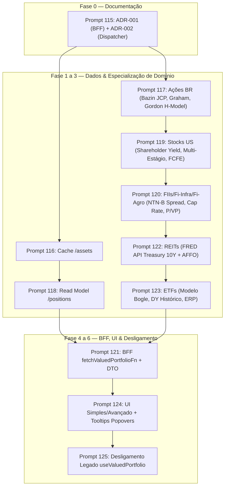

# Plano de Implementação: Execução Completa dos Prompts 115 a 125 (Revisado)
## Fuente Price Pro — BFF, Normalização Firestore e Preço-Teto Especializado por Classe de Ativo

> **Documento de Governança & Execução Técnica**  
> **Conformidade**: 100% alinhado às 9 regras de ouro do [`AGENTS.md`](file:///C:/Users/paulo/OneDrive/Fuente%20Price%20Pro/docs/AGENTS.md).  
> **Branch Alvo**: `dev`  
> **Governança de Commits**: **1 commit individual por prompt (115 a 125)** + relatório unitário de execução + validação dos 3 gates a cada etapa.

---

## 1. Declaração de Governança de Roles (Regra 9 do `AGENTS.md`)

| Role | Status | Atuação no Plano & Execução |
| :--- | :---: | :--- |
| **`fuente-architecture-review`** | ✅ **Ativo** | Garantia de SSOT estrito em `src/lib/calculations.ts` (sem criação de arquivos paralelos de cálculo), verificação de não-duplicação de lógica e validação dos 3 gates de compilação/teste/build. |
| **`fuente-solution-architect`** | ✅ **Ativo** | Desenho do BFF em TanStack Start (`fetchValuedPortfolioFn`), normalização de coleções Firestore (`/assets`, `/positions`, `/transactions`), arquitetura de cache server-side e contratos DTO tipados. |
| **`fuente-business-architect`** | ✅ **Ativo** | Modelagem da capacidade de "Posição Consolidada" como read model idempotente e fluxos de negócio de precificação para as 6 classes de ativos. |
| **`fuente-investidor-profissional`** | ✅ **Ativo** | Validação conceitual dos modelos institucionais: Bazin JCP Líquido (15% WHT), Graham ajustado, Spread NTN-B BACEN para FIIs, Total Shareholder Yield e FCFE para Stocks US, AFFO Yield e Spread Treasury 10Y para REITs, e Retorno Bogle + ERP para ETFs. |
| **`fuente-investidor-iniciante`** | ✅ **Ativo** | Definição dos modos Simples (Presets: Conservador, Moderado, Arrojado) e tradução de jargões técnicos para linguagem de resultado ("Retorno mínimo que você exige" em vez de "Taxa de desconto k"). |
| **`fuente-product-manager`** | ✅ **Ativo** | Sequenciamento em 11 fases incrementais sem big-bang, com paridade de dados validada a cada etapa e relatórios de entrega estruturados para cada prompt. |
| **`fuente-ux-designer`** | ✅ **Ativo** | Arquitetura de "frontend burro" (renderiza `.map()` sobre `assumptions[]`), bottom sheets no padrão `vaul`, popovers direcionais Radix nos ícones de método (sem cobrir números), e mobile-first rigoroso (≤375px). |
| **`fuente-advogado-lgpd-gdpr`** | ✅ **Ativo** | Minimização de dados no DTO privado, segregação rigorosa de catálogo público (`/assets`) vs dados do usuário (`/users/{uid}`), e isolamento de ambiente. |
| **`fuente-product-marketing`** | ✅ **Ativo** | Posicionamento do Preço-Teto Especializado e Consenso Multi-Ativo como *moat* institucional contra StatusInvest e Investidor10. |

---

## 2. Visão Geral dos 11 Prompts a Executar

---

## 3. Detalhamento Técnico Passo a Passo

### Prompt 115 — ADR-001 (BFF) + ADR-002 (Dispatcher de Valuation)
- **Ação**: Criação de `docs/architecture/adrs/ADR-001-bff-e-normalizacao-firestore.md` e `docs/architecture/adrs/ADR-002-dispatcher-valuation-por-classe.md`.
- **Conteúdo ADR-001**: Contexto, decisões, alternativas rejeitadas (GraphQL, API Gateway), contratos completos `ValuedPortfolioDTO` e `MoneyDTO`, dono único de escrita em `/users/{uid}/positions`.
- **Conteúdo ADR-002**: Contexto da especialização por classe, proibição de arquivos de cálculo paralelos, interfaces `ValuationResult` e `ValuationAssumption`, premissas resolvidas pelo backend.
- **Arquivos**:
  - `[NEW]` [ADR-001](file:///C:/Users/paulo/OneDrive/Fuente%20Price%20Pro/docs/architecture/adrs/ADR-001-bff-e-normalizacao-firestore.md)
  - `[NEW]` [ADR-002](file:///C:/Users/paulo/OneDrive/Fuente%20Price%20Pro/docs/architecture/adrs/ADR-002-dispatcher-valuation-por-classe.md)
- **Entrega & Commit**: `docs(architecture): add ADR-001 (BFF & normalizacao) and ADR-002 (valuation dispatcher) [Prompt 115]`.

### Prompt 116 — Cache `/assets/{ticker}`
- **Ação**: Criar serviço server-side de cache `/assets/{ticker}` com fallback síncrono para as 8 fontes externas já existentes.
- **Lógica**: Leitura rápida em Firestore/memória com constante nomeada `ASSET_CACHE_TTL_MS = 300_000` (5 minutos). Se expirado ou inexistente, consulta as fontes atuais (`brapi`, `yahoo`, `cvm`, `secEdgar`, `nasdaq`, `bcb`), grava no cache e retorna.
- **Arquivos**:
  - `[NEW]` [assetCache.server.ts](file:///C:/Users/paulo/OneDrive/Fuente%20Price%20Pro/src/lib/api/assetCache.server.ts)
  - `[MODIFY]` [apiService.functions.ts](file:///C:/Users/paulo/OneDrive/Fuente%20Price%20Pro/src/lib/apiService.functions.ts)
  - `[NEW]` [assetCache.server.test.ts](file:///C:/Users/paulo/OneDrive/Fuente%20Price%20Pro/src/lib/api/__tests__/assetCache.server.test.ts)
- **Entrega & Commit**: `feat(cache): implement server-side asset cache with TTL and sync fallback [Prompt 116]`.

### Prompt 117 — Ações BR Especializadas (`STOCK_BR`)
- **Ação**: Implementar `valuateStockBR` dentro do SSOT `src/lib/calculations.ts`.
- **Lógica**:
  - Bazin com JCP líquido (retenção 15% IR na fonte sobre JCP).
  - Graham com margem de segurança configurável ($\sqrt{22.5 \cdot LPA \cdot VPA}$).
  - Gordon tradicional ($D_1 / (r - g)$) com $g = ROE \times (1 - Payout)$.
  - DDM H-Model de 2 estágios para empresas em expansão.
  - Populamento completo de `assumptions[]` (`label`, `helperText`, `suggestedRange`, `confidenceBadge`).
  - Fuente Consensus restrito aos métodos de `STOCK_BR`.
- **Arquivos**:
  - `[MODIFY]` [calculations.ts](file:///C:/Users/paulo/OneDrive/Fuente%20Price%20Pro/src/lib/calculations.ts)
  - `[MODIFY]` [dict.pt.ts](file:///C:/Users/paulo/OneDrive/Fuente%20Price%20Pro/src/lib/i18n/dict.pt.ts)
  - `[MODIFY]` [dict.en.ts](file:///C:/Users/paulo/OneDrive/Fuente%20Price%20Pro/src/lib/i18n/dict.en.ts)
  - `[MODIFY]` [dict.es.ts](file:///C:/Users/paulo/OneDrive/Fuente%20Price%20Pro/src/lib/i18n/dict.es.ts)
  - `[NEW]` [calculations_stock_br.test.ts](file:///C:/Users/paulo/OneDrive/Fuente%20Price%20Pro/src/lib/__tests__/calculations_stock_br.test.ts)
- **Entrega & Commit**: `feat(valuation): specialize Brazilian stock valuation with net JCP and H-Model [Prompt 117]`.

### Prompt 118 — Read Model `/users/{uid}/positions` (Análise Prévia de Mecanismo)
- **Ação**: Implementar consolidação idempotente de posições com base no ledger de transações.
- **Análise Prévia de Mecanismos**:
  1. **Opção A (Cloud Function trigger `onWrite` em `/users/{uid}/transactions/{txId}`)**:
     - *Vantagens*: Desacoplamento assíncrono total; garante que qualquer inserção (API, admin, script) atualize a posição automaticamente.
     - *Desvantagens*: Complexidade de deploy separado (`functions/`), cold start do Cloud Run/Functions, latência de consistência eventual (500ms-2s).
  2. **Opção B (Rotina Transacional Síncrona via Server Function TanStack Start / BFF)**:
     - *Vantagens*: Consistência imediata no mesmo runtime de produção (Cloud Run único), 0 latência extra de cold start, custo operacional consolidado em 1 serviço.
     - *Desvantagens*: Exige que todas as mutações de transação passem pelo endpoint/server function correspondente.
- **Decisão a ser submetida na rodada do Prompt 118**: Apresentar os trade-offs detalhados para decisão final antes de codificar.
- **Arquivos**:
  - `[NEW]` [positions.server.ts](file:///C:/Users/paulo/OneDrive/Fuente%20Price%20Pro/src/lib/api/positions.server.ts) (ou `functions/src/index.ts` conforme decisão)
  - `[NEW]` [positionsSync.test.ts](file:///C:/Users/paulo/OneDrive/Fuente%20Price%20Pro/src/lib/__tests__/positionsSync.test.ts)
- **Entrega & Commit**: `feat(positions): add idempotent position consolidation read model [Prompt 118]`.

### Prompt 119 — Stocks US Especializadas (`STOCK_US`)
- **Ação**: Implementar `valuateStockUS` dentro de `src/lib/calculations.ts`.
- **Lógica**:
  - Total Shareholder Yield (dividendos + recompras via variação de float no SEC EDGAR).
  - Gordon Multi-Estágio para Dividend Aristocrats.
  - FCFE Yield Teto.
  - Peter Lynch Modificado (PEG + Dividend Yield).
  - Withholding tax de 30% aplicada ao provento líquido base.
  - Retorno de `assumptions[]` e mediana exclusiva de `STOCK_US`.
- **Arquivos**:
  - `[MODIFY]` [calculations.ts](file:///C:/Users/paulo/OneDrive/Fuente%20Price%20Pro/src/lib/calculations.ts)
  - `[NEW]` [calculations_stock_us.test.ts](file:///C:/Users/paulo/OneDrive/Fuente%20Price%20Pro/src/lib/__tests__/calculations_stock_us.test.ts)
- **Entrega & Commit**: `feat(valuation): implement specialized US stock valuation with shareholder yield [Prompt 119]`.

### Prompt 120 — FIIs / Fi-Infra / Fi-Agro (`FII`, `FII_INFRA`, `FIAGRO`)
- **Ação**: Implementar `valuateFundoImobiliario` dentro de `src/lib/calculations.ts`.
- **Lógica**:
  - Bazin com Spread sobre NTN-B (curva BACEN): Fi-Infra isento 1,5%-2,5%, FII Papel/Fi-Agro 2,5%-4,0%, Tijolo 1,5%-3,0%.
  - Gordon com Repasse Inflacionário.
  - Cap Rate Reverso para Tijolo (com marcação de `confidenceBadge: 2` quando estimado).
  - P/VP Dinâmico Ancorado em Risco de Crédito.
  - Proibição de aplicar LPA/VPA de ações a fundos imobiliários.
- **Arquivos**:
  - `[MODIFY]` [calculations.ts](file:///C:/Users/paulo/OneDrive/Fuente%20Price%20Pro/src/lib/calculations.ts)
  - `[NEW]` [calculations_fiis.test.ts](file:///C:/Users/paulo/OneDrive/Fuente%20Price%20Pro/src/lib/__tests__/calculations_fiis.test.ts)
- **Entrega & Commit**: `feat(valuation): implement specialized real estate and credit fund valuation [Prompt 120]`.

### Prompt 121 — BFF `fetchValuedPortfolioFn`
- **Ação**: Implementar server function TanStack Start que lê `/positions`, `/assets`, taxas de câmbio, executa `getAssetValuation` e retorna `ValuedPortfolioDTO`.
- **Lógica**:
  - DTO atualizado com `ValuationResult` real (incluindo `assumptions[]` e métodos específicos).
  - Acionamento via Feature Gate (`useFeatureGate("bffValuedPortfolio")`).
  - Não remove o caminho client-side existente.
- **Arquivos**:
  - `[MODIFY]` [apiService.functions.ts](file:///C:/Users/paulo/OneDrive/Fuente%20Price%20Pro/src/lib/apiService.functions.ts)
  - `[MODIFY]` [featureGates.ts](file:///C:/Users/paulo/OneDrive/Fuente%20Price%20Pro/src/lib/featureGates.ts)
  - `[MODIFY]` [useValuedPortfolio.tsx](file:///C:/Users/paulo/OneDrive/Fuente%20Price%20Pro/src/lib/useValuedPortfolio.tsx)
  - `[NEW]` [bffValuedPortfolio.test.ts](file:///C:/Users/paulo/OneDrive/Fuente%20Price%20Pro/src/lib/__tests__/bffValuedPortfolio.test.ts)
- **Entrega & Commit**: `feat(bff): add fetchValuedPortfolioFn with feature gate and extended DTO [Prompt 121]`.

### Prompt 122 — REITs US (`REIT`) & FRED API (US Treasury 10Y)
- **Ação**: Criar `src/lib/api/fred.server.ts` e implementar `valuateREIT` em `src/lib/calculations.ts`.
- **Lógica**:
  - `fred.server.ts`: Busca taxa do US Treasury 10Y via API pública do St. Louis Fed com taxonomia padrão (`PASSED/FAILED/ERROR/INVALID/WARNING/SKIPPED`).
  - `valuateREIT`: AFFO Yield Model, DDM sobre crescimento de AFFO, NAV Discount Model (5%-15%), e Spread sobre Treasury 10Y por subsegmento.
- **Arquivos**:
  - `[NEW]` [fred.server.ts](file:///C:/Users/paulo/OneDrive/Fuente%20Price%20Pro/src/lib/api/fred.server.ts)
  - `[NEW]` [fred.server.test.ts](file:///C:/Users/paulo/OneDrive/Fuente%20Price%20Pro/src/lib/api/__tests__/fred.server.test.ts)
  - `[MODIFY]` [calculations.ts](file:///C:/Users/paulo/OneDrive/Fuente%20Price%20Pro/src/lib/calculations.ts)
  - `[NEW]` [calculations_reits.test.ts](file:///C:/Users/paulo/OneDrive/Fuente%20Price%20Pro/src/lib/__tests__/calculations_reits.test.ts)
- **Entrega & Commit**: `feat(valuation): integrate FRED API Treasury 10Y and specialized REIT valuation [Prompt 122]`.

### Prompt 123 — ETFs (`ETF`)
- **Ação**: Implementar `valuateETF` dentro de `src/lib/calculations.ts`.
- **Lógica**:
  - Equação de Retorno Total de Bogle ($DY + \text{Earnings Growth}$).
  - Bazin de DY Histórico para ETFs de dividendo (SCHD, VYM, DIVO11).
  - Earnings Yield Gap / Equity Risk Premium para ETFs amplos (IVVB11, VOO, VT, BOVA11).
  - Análise formal e transparente do Shiller CAPE (Gap 3).
- **Arquivos**:
  - `[MODIFY]` [calculations.ts](file:///C:/Users/paulo/OneDrive/Fuente%20Price%20Pro/src/lib/calculations.ts)
  - `[NEW]` [calculations_etfs.test.ts](file:///C:/Users/paulo/OneDrive/Fuente%20Price%20Pro/src/lib/__tests__/calculations_etfs.test.ts)
- **Entrega & Commit**: `feat(valuation): implement specialized ETF valuation with Bogle model and ERP [Prompt 123]`.

### Prompt 124 — UI Simples / Avançado & Tooltips Popovers
- **Ação**: Implementar controles de premissas com toggle Simples/Avançado e tooltips direcionais nos cards de métodos de valuation.
- **Lógica**:
  - Frontend puramente de apresentação: `.map()` sobre `assumptions[]` do backend.
  - Modo Simples: Preço-teto + helperText + badge do preset ativo.
  - Modo Avançado: Bottom sheet (`vaul`) com sliders por premissa, badges `●●●○`, tap targets $\ge 48\text{px}$, debounce e skeletons.
  - Popovers Radix nos ícones de método (Gordon: para baixo; Bazin/Graham: para cima; Consensus: abaixo centralizado).
  - 100% de textos via i18n.
- **Arquivos**:
  - `[NEW]` [ValuationAssumptionsSheet.tsx](file:///C:/Users/paulo/OneDrive/Fuente%20Price%20Pro/src/components/ceiling/watchlist/ValuationAssumptionsSheet.tsx)
  - `[MODIFY]` [ConsensusPyramid.tsx](file:///C:/Users/paulo/OneDrive/Fuente%20Price%20Pro/src/components/ceiling/watchlist/ConsensusPyramid.tsx)
  - `[MODIFY]` [AssetDetailSheet.tsx](file:///C:/Users/paulo/OneDrive/Fuente%20Price%20Pro/src/components/ceiling/watchlist/AssetDetailSheet.tsx)
  - `[MODIFY]` [dict.pt.ts](file:///C:/Users/paulo/OneDrive/Fuente%20Price%20Pro/src/lib/i18n/dict.pt.ts), [dict.en.ts](file:///C:/Users/paulo/OneDrive/Fuente%20Price%20Pro/src/lib/i18n/dict.en.ts), [dict.es.ts](file:///C:/Users/paulo/OneDrive/Fuente%20Price%20Pro/src/lib/i18n/dict.es.ts)
- **Entrega & Commit**: `feat(ui): add Simple/Advanced assumption controls and directional tooltips [Prompt 124]`.

### Prompt 125 — Desligamento do Caminho Legado
- **Ação**: Migrar `useValuedPortfolio` para consumir exclusivamente `fetchValuedPortfolioFn`, removendo as 7 queries client-side redundantes da carteira com plano de rollback garantido.
- **Lógica**:
  - Limpeza de código morto de agregação sem remover hooks necessários para outras telas.
  - Validação completa de paridade de dados.
- **Arquivos**:
  - `[MODIFY]` [useValuedPortfolio.tsx](file:///C:/Users/paulo/OneDrive/Fuente%20Price%20Pro/src/lib/useValuedPortfolio.tsx)
- **Entrega & Commit**: `refactor(portfolio): decommission client-side valuation merge in favor of BFF [Prompt 125]`.

---

## 4. Pontos de Atenção & Decisões de Arquitetura (Formato Risco → Decisão)

1. **Risco**: Quebra da Regra 4 (SSOT) por criação acidental de múltiplos arquivos de cálculo (`calculationsBR.ts`, `calculationsUS.ts`).  
   **Decisão**: Todas as fórmulas de todas as classes de ativos (Ações BR, Stocks US, FIIs, REITs, ETFs) residem estritamente em `src/lib/calculations.ts`, orquestradas internamente pelo dispatcher `getAssetValuation`.

2. **Risco**: Fórmulas com taxas e spreads fixos sem rastreabilidade ou ajuste pelo investidor.  
   **Decisão**: Todo parâmetro financeiro é parametrizável e exposto como item no array `assumptions[]` do `ValuationResult`, com valores sugeridos pelo backend e badges de confiança auditáveis (`●●●○`).

3. **Risco**: Divergência numérica ou regressão na carteira durante a transição para o BFF.  
   **Decisão**: A migração é protegida por Feature Gate (`useFeatureGate("bffValuedPortfolio")`), com testes automatizados de paridade 1:1 entre a computação client-side e a resposta do BFF antes do desligamento definitivo.

4. **Risco**: Inconsistência ou escrita concorrente em `/users/{uid}/positions`.  
   **Decisão**: Estabelecer regra rígida de Dono Único de Escrita: apenas a rotina transacional derivadora do ledger de transactions escreve em `/positions`. A UI nunca escreve diretamente em `/positions`.

5. **Risco**: Indisponibilidade da FRED API (St. Louis Fed) interrompendo a precificação de REITs.  
   **Decisão**: Implementar timeout e fallback resiliente na FRED API (taxa histórica padrão conservadora) com redução do `confidenceBadge` para `2` quando a taxa ao vivo não responder.

6. **Risco**: Violação da Regra 2 (i18n Enforcement) com textos ou labels hardcoded em componentes React ou DTOs.  
   **Decisão**: 100% dos textos visíveis na interface, helperTexts de premissas e descrições de tooltips utilizam chaves dos dicionários `dict.pt.ts`, `dict.en.ts` e `dict.es.ts`.

---

## 5. Plano de Verificação & Governança de Commits

### Gates de Verificação Obrigatórios a Cada Prompt (Regra 8 do `AGENTS.md`)
1. **Gate 1 — TypeScript**: `npx tsc --noEmit` limpo com exatamente 0 erros.
2. **Gate 2 — Testes Automatizados**: `npm run test` com 100% dos testes passando sem nenhuma falha em toda a suite.
3. **Gate 3 — Build de Produção**: `npm run build` limpo e sem warnings bloqueantes.

### Governança de Commits e Relatórios Unitários (Correção 1)
- **Commit Individual por Prompt**: Cada prompt executado (115 a 125) receberá seu próprio commit isolado e atômico, seguindo o padrão de commit semântico `type(scope): description [Prompt N]`.
- **Relatório Unitário por Prompt**: Cada entrega será acompanhada de um relatório individual no chat e registrado em `docs/PROMPTS_LOG.md` (ou arquivo equivalente), com resumo de ações, evidência dos 3 gates e exemplos quando aplicável.
- **Rollback Garantido**: Nenhuma alteração será agrupada em lote, assegurando reversibilidade granular de cada fase.
