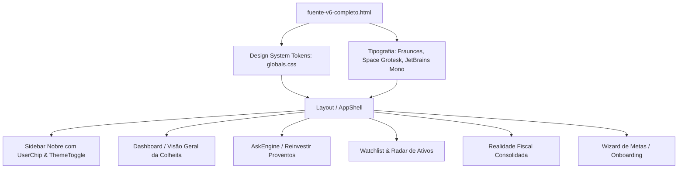

# Mapeamento AS-IS / TO-BE — Fuente Price Pro (Protótipo v6)

> **Documento de Referência Arquitetural e Visual**
> **Protótipo de Destino (TO-BE)**: [`docs/design/fuente-v6-completo.html`](file:///c:/Users/paulo/OneDrive/Fuente%20Price%20Pro/docs/design/fuente-v6-completo.html)
> **Diretiva Central**: Atingir paridade exata com o protótipo v6 em design visual, tipografia, paleta nobre, layouts, microinterações e componentes, mantendo 100% da integridade da Single Source of Truth (SSOT - `docs/SSOT.md`) e da governança técnica (`docs/AGENTS.md`).

---

## 1. Visão Geral e Princípios de Design (TO-BE)

O protótipo v6 estabelece a identidade visual definitiva do **Fuente Price Pro**: uma estética nobre, editorial e orientada a investidores sérios de renda passiva (estilo *Financial Times* / *Bloomberg Wealth* com atmosfera orgânica de colheita/dividendos).

### 1.1 Tipografia Canônica
| Família | Aplicação no TO-BE |
| :--- | :--- |
| **`Fraunces`** (Serif) | Títulos principais (`h1`, `h2`, `h3`), valores monetários de destaque (`.kv`, `.big`, `.fh-big`, `.iv`), títulos dos cards de perguntas (`.ask-q`, `.wq`). |
| **`Space Grotesk`** (Sans) | Corpo de texto (`body`), labels de formulários, navegação da sidebar, descrições, botões e badges. |
| **`JetBrains Mono`** (Monospace) | Tickers de ativos (`PETR4`, `HGLG11`), valores tabulares numéricos (`td.num`), percentuais (`.kd`), datas e indicadores de métricas. |

### 1.2 Paleta de Cores e Tokens CSS
| Token | Modo Claro (`light`) | Modo Escuro (`dark`) | Finalidade |
| :--- | :--- | :--- | :--- |
| `--paper` | `#f6f2ea` | `#0a1410` | Fundo principal da aplicação com micro-textura radial |
| `--paper2` | `#efe9dc` | `#101d16` | Fundo secundário para inputs, barras de progresso e tracks |
| `--card` | `#fffdf8` | `#131f18` | Fundo de cards, containers de métricas e tabelas |
| `--ink` | `#14201a` | `#e9e3d5` | Cor primária do texto e contrastes fortes |
| `--muted` | `rgba(20,32,26,0.52)` | `rgba(233,227,213,0.52)` | Rótulos secundários, unidades e textos de apoio |
| `--nav` | `#0e2a1f` | `#08110d` | Fundo do menu lateral (verde-musgo imperial profundo) |
| `--navfg` | `#f6f2ea` | `#e9e3d5` | Tipografia da sidebar |
| `--moss-700` | `#1c4a34` | `#245c40` | Botões primários, itens de navegação ativos, acentos |
| `--moss-500` | `#2f6b4c` | `#57a97b` | Destaques positivos, gradientes de alocação e indicadores |
| `--gold-500` | `#c99a3a` | `#e9c877` | Dourado de destaque de dividendos, metas e badges |
| `--gold-300` | `#e9c877` | `#f0d792` | Dourado claro para contrastes sobre o verde-musgo |
| `--pos` / `--neg` | `#2f6b4c` / `#b5533a` | `#57a97b` / `#e2795e` | Variações positivas / negativas de cotação e rentabilidade |

---

## 2. Mapeamento Módulo a Módulo: AS-IS vs TO-BE

### Módulo 1: App Shell, Sidebar e Navegação

| Aspecto | AS-IS (Atual no Repositório) | TO-BE (Protótipo v6) | Ação de Migração |
| :--- | :--- | :--- | :--- |
| **Sidebar Desktop** | Sidebar expansível/colapsável com cores neutras padrão do shadcn/ui (`bg-sidebar`). | Menu fixo verde-musgo imperial (`#0e2a1f`), logo serifado em `Fraunces` com subtítulo dourado trackeado, contadores numéricos estilizados (`.cnt`). | Refatorar `Sidebar` / layout base aplicando variáveis `--nav`, tipografia e badges exatos do protótipo. |
| **User Chip** | Menu de perfil em dropdown genérico no cabeçalho ou lateral. | Card de usuário integrado ao rodapé da sidebar com avatar dourado (`.uav`), nome, tipo de plano e toggle de tema `Dark / Light` inline (`.tt`). | Implementar componente `UserChip` com toggle dark/light no rodapé da barra lateral. |
| **Fundo Global** | Fundo liso cinza claro/escuro. | Fundo `--paper` com micro-textura pontilhada radial (`radial-gradient` de 3px). | Injetar estilo de textura e tokens no `globals.css` e no container principal. |

---

### Módulo 2: Dashboard / Visão Geral da Colheita

| Aspecto | AS-IS (Atual no Repositório) | TO-BE (Protótipo v6) | Ação de Migração |
| :--- | :--- | :--- | :--- |
| **KPIs de Destaque** | 4 caixas `MetricBox` retangulares padrão. | Grid de 4 KPIs com rótulo mono trackeado (`.kl`), valor em `Fraunces` de 23px (`.kv`) e badge de tendência colorido (`.kd`). | Atualizar `MetricBox` com os seletores CSS e tipografia `.kl`, `.kv`, `.kd`. |
| **Gauge da Liberdade Financeira** | Não existe gauge visual de cobertura de custo de vida. | Card com gauge horizontal de progresso da Liberdade Financeira (Renda Mensal vs Custo de Vida), indicando % atingido e valor em Fraunces 42px. | Criar componente `FinancialFreedomGauge` consumindo `useFIProgress`. |
| **Gráfico dos 12 Meses** | Gráficos Recharts genéricos em tons de azul/roxo. | Visualizador de 12 colunas mensais com barras em degradê dourado (`gold-300` a `gold-500`) e destaque de "meses secos" em vermelho (`.mo.dry`). | Criar componente `TwelveMonthHarvestGrid` estilizado exatamente como o protótipo. |
| **Digest / Linha do Tempo** | Lista de transações ou notificações simples. | Painel `.dg` com cards de eventos recentes (Dividendos recebidos, Data-Com anunciada, Alerta de Risco/Yield Trap) com ícones coloridos (`.ic.good`, `.ic.warn`, `.ic.bad`). | Criar componente `HarvestDigestTimeline` consumindo histórico de eventos do SSOT. |

---

### Módulo 3: AskEngine / Reinvestir Proventos (Motor de Alocação)

| Aspecto | AS-IS (Atual no Repositório) | TO-BE (Protótipo v6) | Ação de Migração |
| :--- | :--- | :--- | :--- |
| **Hero de Reinvestimento** | Formulário com abas shadcn/ui e input clássico. | Card imersivo `.ask` com pergunta serifada em `Fraunces` 19.5px, input de valor em `Fraunces` 27px integrado com fundo `--paper2`. | Atualizar `AskScreen.tsx` para seguir o layout `.ask-top`, `.ask-amt` e `.ask-q`. |
| **Seletor de Estratégias** | Abas de texto padrão. | Barra horizontal `.strat` dividida em 4 blocos de estratégia (Corrigir Desvio, Maior Yield, Reforçar Pagador, Oportunidades Abaixo do Teto) com subtítulos em caixa alta. | Refatorar seletor de estratégias para o design de abas integradas `.strat` e `.st.on`. |
| **Linhas de Alocação** | Tabela tradicional com linhas simples. | Linhas `.alloc` com ranking numérico em badge dourado (`.rank`), ticker em destaque, barra de alocação em gradiente (`moss-500` -> `gold-500`), valor em Fraunces e racional em destaque. | Refatorar lista de sugestões de compra para o componente `.alloc`. |
| **Rodapé de Impacto** | Resumo simples de sobra de caixa. | Rodapé `.ask-foot` com impacto projetado de renda anual adicionada e sobra em dinheiro, mais o disclaimer regulatório versionado `.disc`. | Atualizar rodapé da tela de reinvestimento com o layout do protótipo. |

---

### Módulo 4: Radar de Ativos & Watchlist

| Aspecto | AS-IS (Atual no Repositório) | TO-BE (Protótipo v6) | Ação de Migração |
| :--- | :--- | :--- | :--- |
| **Tabela de Ativos** | Tabela densa padrão com colunas monocromáticas. | Tabela editorial com headers mono em uppercase, tickers em JetBrains Mono com subtítulo do setor, preço teto Bazin/Graham com barra visual de margem de segurança. | Atualizar `Watchlist.tsx` e `AssetCard.tsx` com as classes de estilo do protótipo. |
| **Pills de Status** | Badges comuns do Tailwind (`rounded-md`). | Badges `.pill.pos` (fundo verde suave), `.pill.neg` (fundo coral suave) e `.pill.gold` (fundo dourado) com cantos totalmente arredondados (`rounded-full`). | Padronizar `StatusBadge` com as variantes exatas do protótipo. |
| **Card de Destaque (Insight)** | Banners de aviso simples. | Card `.insight` com degradê suave dourado, ícone destacado, texto com palavras-chave em negrito e valor em Fraunces 31px dourado. | Criar componente reutilizável `InsightBanner`. |

---

### Módulo 5: Realidade Fiscal (Módulo Tributário)

| Aspecto | AS-IS (Atual no Repositório) | TO-BE (Protótipo v6) | Ação de Migração |
| :--- | :--- | :--- | :--- |
| **Hero Fiscal** | Cards soltos de imposto. | Painel `.fiscal-hero` com gauge de imposto apurado vs limite de isenção mensal de R$ 20.000,00 e totalizador em Fraunces 42px. | Integrar o `FiscalHeroGauge` ao topo da `TaxRealityScreen.tsx`. |
| **Breakdown Tributário** | Apenas tabela mês a mês. | Seção `.brk` com caixas de quebra tributária rápida (Ações BR Isentas, FIIs/FIAGROs a 20%, ETFs a 15%, FI-Infra 0% isento, Retenções WHT US 30% e JCP 15% riscadas com `.strike`). | Adicionar a barra de breakdown `.brk` na `TaxRealityScreen.tsx`. |
| **Limites Declarados & Disclaimer** | Caixa de aviso estática. | Caixa estilizada com borda suave, lista com marcadores limpos e disclaimer regulatório persistente. | Manter a conformidade estrita com os dicionários `dict.ptBR.ts`, `dict.en.ts`, `dict.es.ts`. |

---

### Módulo 6: Assistente de Metas / Onboarding (Wizard)

| Aspecto | AS-IS (Atual no Repositório) | TO-BE (Protótipo v6) | Ação de Migração |
| :--- | :--- | :--- | :--- |
| **Configuração de Metas** | Sliders avulsos na tela de configurações. | Wizard interativo `.wiz` com barra de progresso em pontos (`.steps` / `.sdot`), perguntas editoriais em Fraunces 25px (`.wq`), opções em cards clicáveis (`.opt.on`) e sliders com cálculo de soma 100% dinâmica (`.sumline.ok` / `.sumline.bad`). | Criar componente `GoalWizard` reutilizável em Onboarding e na aba de Metas. |

---

## 3. Matriz de Componentes e Estrutura de Arquivos

### Relação de Componentes do TO-BE
1. **`src/components/layout/AppSidebarV6.tsx`**: Sidebar fixo verde-musgo com logo editorial e chip de usuário.
2. **`src/components/shared/MetricBox.tsx`**: Atualizado com classes `.kl`, `.kv`, `.kd`.
3. **`src/components/shared/StatusBadge.tsx`**: Atualizado com classes `.pill.pos`, `.pill.neg`, `.pill.gold`.
4. **`src/components/shared/InsightBanner.tsx`**: Card `.insight` com degradê dourado.
5. **`src/components/harvest/FinancialFreedomGauge.tsx`**: Barra de progresso da Liberdade Financeira.
6. **`src/components/harvest/TwelveMonthHarvestGrid.tsx`**: Visualizador de colunas dos 12 meses.
7. **`src/components/harvest/HarvestDigestTimeline.tsx`**: Timeline de eventos da carteira.
8. **`src/components/ask/AskReinvestCard.tsx`**: Card imersivo de alocação de proventos.
9. **`src/components/tax/TaxHeroBreakdown.tsx`**: Breakdown visual de retenções e tributação.
10. **`src/components/goals/GoalWizard.tsx`**: Assistente de metas passo a passo.

---

## 4. Roteiro de Implementação em Lotes (Roadmap TO-BE)

### Lote 1: Fundação Visual, Tipografia e Tokens CSS
- Inclusão das fontes Google (`Fraunces`, `Space Grotesk`, `JetBrains Mono`) no index/layout.
- Definição completa das variáveis de tema em `src/styles/globals.css` (`--paper`, `--paper2`, `--card`, `--ink`, `--muted`, `--nav`, `--moss-700`, `--moss-500`, `--gold-500`, `--gold-300`).
- Configuração do Tailwind para mapear essas variáveis em classes utilitárias.

### Lote 2: App Shell e Sidebar Definitivo
- Construção da nova Sidebar em conformidade total com o protótipo.
- Integração do `UserChip` com avatar dourado e toggle de tema `Dark / Light`.

### Lote 3: Dashboard da Colheita (Visão Geral)
- Implementação dos cards de KPIs editoriais (`.kpis`, `.kpi`).
- Criação do `FinancialFreedomGauge` e do `TwelveMonthHarvestGrid`.
- Integração do `HarvestDigestTimeline`.

### Lote 4: AskEngine / Reinvestimento Visual
- Migração completa do `AskScreen.tsx` para o layout `.ask` do protótipo v6.
- Implementação das barras de alocação em degradê e do rodapé de impacto projetado.

### Lote 5: Radar de Ativos e Watchlist
- Atualização visual da tabela e dos cards de ativos com tipografia mono nos tickers, margem de segurança visual e badges pill.
- Integração dos cards de `.insight`.

### Lote 6: Realidade Fiscal e Assistente de Metas
- Integração do hero fiscal com gauge de isenção de vendas mensais de R$ 20k.
- Implementação do Wizard de Metas (`.wiz`).

---

## 5. Garantia de Governança e Não Regressão

1. **SSOT Intacto**: Nenhuma função pura de cálculo financeiro (`calculations.ts`, `realizedIncome.ts`, `fiiCapitalGains.ts`, `monthlyExemption.ts`, `etfCapitalGains.ts`, `fiInfraCapitalGains.ts`) sofrerá alterações em suas fórmulas matemáticas.
2. **Gates Obrigatórios**: Toda alteração visual será submetida aos 3 gates do projeto:
   - `npx tsc --noEmit`
   - `npm run test`
   - `npm run build`
3. **i18n Rigoroso**: Todos os textos visíveis na interface consumirão as chaves dos dicionários (`ptBR`, `en`, `es`).
