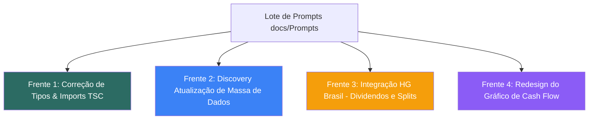

# Plano de Implementação & Discovery — Lote de Prompts (16/08/2026)

> **Governança:** 100% aderente a [`docs/AGENTS.md`](file:///C:/Users/paulo/OneDrive/Fuente%20Price%20Pro/docs/AGENTS.md) e ao [`docs/SSOT.md`](file:///C:/Users/paulo/OneDrive/Fuente%20Price%20Pro/docs/SSOT.md).  
> **Precedência:** Este documento cumpre as Regras 8 e 9 do `AGENTS.md`, apresentando o diagnóstico, decisões pendentes e plano para aprovação prévia antes de qualquer execução de escrita ou alteração de dados.

---

## 🧭 1. Governança de Roles (Regra 9)

| Role | Engajado? | Justificativa / Papel no Lote |
|---|---|---|
| `fuente-architecture-review` | ✅ Sim | Validação dos gates de compilação, isolamento de imports e integridade de tipos. |
| `fuente-solution-architect` | ✅ Sim | Desenho do cliente HG Brasil, estratégia de cache `/assets` e barramento de desdobramentos. |
| `fuente-business-architect` | ✅ Sim | Modelagem de custos de leitura/escrita no Firestore e planos de API de mercado (HG Brasil). |
| `fuente-product-manager` | ✅ Sim | Sequenciamento das fases de entrega e definição de escopo (ex: 2 estados no Cash Flow). |
| `fuente-ux-designer` | ✅ Sim | Especificação visual do novo gráfico de Cash Flow (legenda superior, tokens Horizonte FI, mobile). |
| `fuente-investidor-profissional` | ✅ Sim | Rigor de dados financeiros: auditabilidade de dividendos brutos vs. líquidos e não-suavização de splits. |
| `fuente-investidor-iniciante` | ✅ Sim | Garantia de que a legenda e tooltips do Cash Flow sejam compreensíveis sem jargões complexos. |
| `fuente-advogado-lgpd-gdpr` | ⚪ Não se aplica | Nenhuma alteração toca dados pessoais (PII) ou fluxos de privacidade; são correções de tipos, design e APIs de mercado públicas. |
| `fuente-product-marketing` | ⚪ Não se aplica | Nenhuma alteração de copy promocional ou posicionamento de produto nesta rodada. |

---

## 📦 2. Estrutura e Sequenciamento do Lote de Prompts

O lote de 5 prompts foi organizado em **4 frentes de trabalho** estritamente isoladas:

---

## 🔧 Frente 1: Correção de Imports de `apiService` e `any` Implícito
**Arquivos de origem:** `prompt_fix_apiservice_imports.md` e `prompt_fix_any_implicito.md`

### Diagnóstico Técnico
O comando `npx tsc --noEmit` aponta exatamente **12 erros** no repositório causados pela renomeação anterior para `.functions.ts` onde imports de tipo continuaram apontando para `.server`:
- 9 arquivos de componentes e 2 de testes importando `@/lib/apiService.server` ou `../apiService.server`.
- Em `src/components/shared/TickerSearchField.tsx`, o erro de resolução fez a tipagem `SearchHit` virar `any`, causando o erro `TS7053: Element implicitly has an 'any' type` ao indexar `Record<AssetType, string>`.

### Arquivos a Modificar
- `src/components/ceiling/AssetComparator.tsx`
- `src/components/ceiling/AssetForm.tsx`
- `src/components/ceiling/watchlist/assetCard/AssetCardHeader.tsx`
- `src/components/ceiling/watchlist/useLiveQuotesAndMeta.ts`
- `src/components/ceiling/watchlist/WatchlistActionsContext.tsx`
- `src/components/ceiling/watchlist/WatchlistTable.tsx`
- `src/components/horizonte/NewContributionDialog.tsx`
- `src/components/shared/AssetCard.tsx`
- `src/components/shared/TickerSearchField.tsx`
- `src/lib/__tests__/benchmarkHistory.test.ts`
- `src/lib/__tests__/formatYahooTicker.test.ts`

### Pontos de Atenção & Decisões de Arquitetura (Frente 1)
- **Risco:** Usar `as any` ou `@ts-ignore` para silenciar o erro.  
  **Decisão:** Corrigir os caminhos de importação para `@/lib/apiService.functions` e tipar explicitamente a variável `a.type as AssetType` ou importar diretamente de `src/lib/api/types.ts`.
- **Risco:** Regressão no runtime durante a alteração de tipos.  
  **Decisão:** Nenhuma linha de lógica executável será alterada; apenas os caminhos de import de tipos TypeScript.

---

## 📊 Frente 2: Discovery — Atualização de Massa de Dados (`/assets/{ticker}`)
**Arquivo de origem:** `prompt_atualizar_massa_dados.md`

### Diagnóstico Técnico & Levantamento
1. **Natureza do Cache de Ativos:**
   - Em `src/lib/api/assetCache.server.ts`, o cache de ativos implementado no Prompt 116 é um **In-Memory Cache (RAM)** no Cloud Run com `ASSET_CACHE_TTL_MS = 300_000` (5 minutos).
   - **Ele não grava documentos persistentes desatualizados no Firestore `/assets` que necessitem de migração de banco de dados (data patch script).**
   - Cada Cloud Run instance recicla a memória periodicamente. Ao expirar o TTL de 5 minutos, o próximo acesso de qualquer usuário aciona automaticamente o dispatcher atualizado (`getAssetValuation` em `calculations.ts`), calculando `usTreasury10Y`, `assumptions[]`, `shareholderYield`, etc. em tempo real.
2. **Impacto em Usuários / Posições:**
   - Como o cálculo de valuation em carteiras salvas (`useValuedPortfolio`) consome as cotações e metadados frescos das APIs externas, nenhum usuário possui dados "congelados" permanentemente no banco.
3. **Decisão Submetida à Aprovação (Opções A, B, C do Prompt):**
   - **Opção A (Recomendada):** *Deixar o tráfego orgânico repopular sob demanda.* Como o cache expira em 5 minutos, zero script de escrita é necessário. Custo adicional no Firestore: **R$ 0,00**. Risco de rate limit: **Zero**.
   - **Opção B:** *Script de refresh em lote de todos os ativos do catálogo.* Desnecessário e perigoso: pode disparar rate limit no plano free da Brapi/Yahoo ou da API do FRED.
   - **Opção C:** *Refresh em lote segmentado (só REIT e ETF).* Também dispensável devido ao TTL volátil de 5 minutos.

### Pontos de Atenção & Decisões de Arquitetura (Frente 2)
- **Risco:** Disparar escritas em massa contra o Firebase de produção compartilhado (Regra 3).  
  **Decisão:** Adotar estritamente a **Opção A**, mantendo zero escrita em lote e deixando o TTL de 5 minutos gerenciar a atualização orgânica.

---

## 🌐 Frente 3: Integração HG Brasil — Dividendos e Desdobramentos
**Arquivo de origem:** `prompt_hgbrasil_dividendos_desdobramentos.md`

### Diagnóstico Técnico
A validação prévia em `scripts/validate-bolsai-hgbrasil.ts` comprovou que o endpoint `https://api.hgbrasil.com/v2/finance/dividends?tickers=B3:{ticker}&key={KEY}` retorna com sucesso histórico de proventos e datas de pagamento (`payment_date`).

### Decisões de Arquitetura Pendentes para Aprovação:

#### Decisão 1: Prioridade da Fonte de Dividendos (Parte 1)
- **Opção 1.A (Enriquecimento / Fallback - Recomendada):** Manter Brapi/CVM como fonte primária de valores e usar a HG Brasil prioritariamente para preencher `payment_date` (data de pagamento real) e como fallback de contingência quando a Brapi falhar.
- **Opção 1.B (Substituição Total):** Tornar a HG Brasil a fonte número 1 para todos os ativos brasileiros. *(Trade-off: Consome a cota do plano pago da HG Brasil em todas as consultas básicas).*
- **Decisão Proposta:** Adotar **Opção 1.A** — máxima resiliência e economia de cota de API.

#### Decisão 2: Estratégia de Modelagem de Desdobramentos / Splits (Parte 2 - ALTO RISCO SSOT)
- **Opção 2.A (Ajuste Retroativo Silencioso):** Multiplica a quantidade e divide o preço médio das transações passadas em memória durante o `recalculateHoldingFromTransactions`. *(Trade-off: Opaco para o usuário, destrói a paridade com as notas de corretagem físicas históricas).*
- **Opção 2.B (Evento Sintético Explícito no Ledger - Recomendada):** Criar uma transação do tipo `SPLIT` com valor financeiro R$ 0,00 no histórico, aumentando a quantidade e ajustando o preço médio ponderado no ledger de forma auditável.
- **Decisão Proposta:** Adotar **Opção 2.B**, preservando a rastreabilidade contábil (exigência do `fuente-investidor-profissional` e Regra 4).

### Escopo de Implementação (Parte 1):
1. Criação de `src/lib/api/hgBrasil.server.ts` com taxonomia canônica de status (`PASSED`, `FAILED`, `ERROR`, `INVALID`, `SKIPPED`).
2. Configuração de `HGBRASIL_API_KEY` em `.env.example`.
3. Testes unitários dedicados em `src/lib/api/__tests__/hgBrasil.server.test.ts`.

---

## 📈 Frente 4: Redesign do Gráfico de Cash Flow
**Arquivo de origem:** `prompt_redesign_cashflow.md`

### Diagnóstico Técnico & Escopo Visual
O gráfico atual em `src/components/ceiling/cashflow/CashFlowChart.tsx` utiliza Recharts com barras empilhadas, mas carece de distinção visual nítida entre proventos recebidos e projetados, e a legenda atual não possui o destaque no topo solicitado pelo investidor.

### Proposta de Design System (Horizonte FI)
- **2 Estados Visuais Estritos (Sem terceiro estado):**
  1. **"Proventos recebidos"** (Confirmado / Pago): `var(--primary)` / Petróleo `#2C6B63` sólido.
  2. **"Proventos a receber"** (Projetado futuro): `var(--primary)/40` ou tom esmeralda suave com borda destacada / padrão visual contrastante.
- **Legenda Superior:**
  - Posicionada logo acima do gráfico com badges informativos:
    - `[ ● Proventos recebidos ]` e `[ ◒ Proventos a receber ]`.
    - Badge de destaque para o "Melhor mês" utilizando o token semântico `var(--warning)` / ícone `Award` sutil.
- **Responsividade Mobile (Regra 5):**
  - Legenda em flex-wrap compacto em telas `< 375px`.
  - Scroll horizontal no container do Recharts preservado sem quebrar o layout.
- **Internacionalização (Regra 2):**
  - Chaves nos dicionários `dict.ptBR.ts`, `dict.en.ts`, `dict.es.ts` sob `t.cashFlow.received` e `t.cashFlow.projected`.

### Pontos de Atenção & Decisões de Arquitetura (Frente 4)
- **Risco:** Introduzir bugs de cálculo no montante mensal durante o redesign.  
  **Decisão:** Não alterar a função de agregação de dados `data.map` nem o cálculo de proventos em `cashflow.ts`; refatorar puramente o componente visual de renderização `CashFlowChart.tsx`.

---

## 📋 3. Plano de Execução Sequencial

1. **Commit 1 (Frente 1 - Imediato):**
   - `fix(types): resolve stale apiService.server imports and implicit any [Prompt Fix]`
   - Validação dos 3 gates: `npx tsc --noEmit` (0 erros), `npm run test`, `npm run build`.
2. **Aprovação das Decisões (Frentes 2, 3 e 4):**
   - Confirmação de Paulo sobre a **Opção A** para o Cache (Frente 2), **Opção 1.A + 2.B** para HG Brasil (Frente 3), e aprovação do layout de Cash Flow (Frente 4).
3. **Commit 2 (Frente 4 - Cash Flow):**
   - `feat(cashflow): redesign chart with 2-state legend and Horizonte FI tokens [Prompt CashFlow]`
4. **Commit 3 (Frente 3 - HG Brasil Parte 1 Dividendos):**
   - `feat(api): integrate HG Brasil dividend and paymentDate provider [Prompt HGBrasil]`
