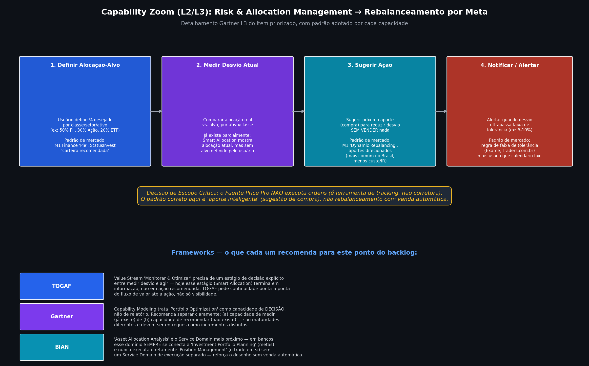
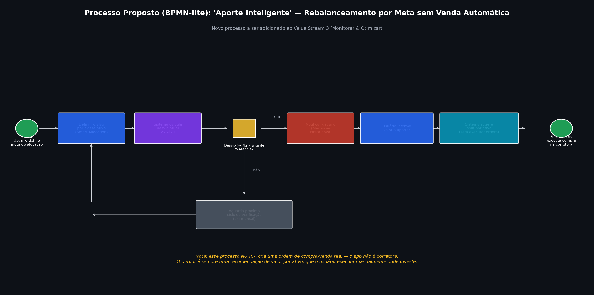

# Discovery: Rebalanceamento por Meta (VS3 — Risk & Allocation)

**Item priorizado**: Tarefa 29.2-29.5 | Fecha o Value Stream 3 (Monitorar & Otimizar) | Prioridade P0

---

## 0. Decisão de Escopo Crítica (antes de qualquer coisa)

O Fuente Price Pro **não é uma corretora** — é uma ferramenta de tracking e decisão. Isso muda completamente o que "rebalanceamento" significa aqui, comparado ao mercado internacional:

- **M1 Finance** (referência global) executa ordens reais: você define um "Pie" com pesos-alvo, deposita dinheiro, e o próprio M1 compra as frações que faltam automaticamente ("Dynamic Rebalancing"). Ele também pode vender posições sobre-alocadas com um clique.
- **StatusInvest** tem uma "carteira automatizada" que também executa ordens de verdade (parceria com corretora/research).
- **Nós não podemos e não devemos fazer isso.** O padrão correto para o Fuente Price Pro é o que o mercado brasileiro chama de **"aporte direcionado"** ou **"aporte inteligente"**: o sistema calcula o desvio entre alocação atual e alocação-alvo, e recomenda **onde colocar o próximo aporte** — sem vender nada, sem enviar ordem, sem tocar em dinheiro real. O usuário decide e executa na própria corretora.

Essa é, inclusive, a prática mais recomendada mesmo por quem tem acesso a rebalanceamento automático: fontes de mercado (Exame, Traders.com.br) confirmam que rebalancear via aportes novos é preferível a vender, porque evita gerar imposto de renda desnecessário e custos de corretagem — e é exatamente o modelo que **não exige que sejamos uma corretora** para entregar valor real.

---

## 1. Como os Benchmarks Fazem Isso

### Investidor10
Anuncia "Rebalanceamento Fácil" como recurso de destaque no gerenciador de carteiras, junto com "Metas Financeiras" (definir metas de vida e acompanhar a jornada) e "Análise em tempo real" com insights de IA. Não é rebalanceamento com execução de ordem — é orientação.

### Kinvo (referência indireta, mas relevante)
No plano Premium, mostra quando você está **sobrealocado** em um setor/classe e usa "sensibilidade de ativos" (correlação entre cada ativo e a carteira) para embasar a recomendação — ou seja, o rebalanceamento não é só "% atual vs % alvo", é contextualizado com risco.

### M1 Finance (referência de padrão de UX, mesmo não sendo aplicável 1:1)
O conceito de **"Pie" com "Slices"** (fatias com peso-alvo) é o padrão de interação mais replicado do mercado para definição de alocação-alvo. A "Dynamic Rebalancing" — direcionar automaticamente cada novo aporte para a fatia mais sub-alocada — é o comportamento que queremos **replicar conceitualmente** (sem execução real): ao invés de comprar automaticamente, nós **calculamos e sugerimos** o mesmo resultado.

### Consenso de mercado sobre frequência/gatilho
Fontes de educação financeira (Exame, Traders, Avenue) convergem em dois modelos de gatilho:
1. **Calendário fixo** (trimestral/semestral/anual) — mais simples, mas pode deixar a carteira desalinhada por muito tempo ou gerar ajustes desnecessários.
2. **Faixa de tolerância** (ex: alerta quando um ativo/classe se desvia 5-10 pontos percentuais do alvo) — mais eficiente, é a abordagem que a maioria dos especialistas recomenda hoje.

**Recomendação**: usar faixa de tolerância como gatilho principal, com fallback de lembrete periódico (ex: mensal) para quem não tem desvio grande mas também não aporta há tempo.

---

## 2. O Que os Frameworks Sugerem

- **TOGAF**: um Value Stream precisa ir do gatilho até o valor entregue de ponta a ponta. Hoje, o VS3 (Monitorar & Otimizar) **termina em informação** (Smart Allocation mostra a alocação atual) mas não chega em ação recomendada. TOGAF orienta fechar esse fluxo até a etapa de decisão — não faz sentido parar em "aqui está o gráfico" sem conectar ao "aqui está o que fazer com isso".

- **Gartner (Business Capability Modeling)**: recomenda tratar **medir** e **recomendar** como duas capacidades de maturidade diferente, não como uma feature única. Isso importa para o roadmap: dá pra entregar em dois incrementos — (1) definir alocação-alvo + medir desvio, depois (2) motor de sugestão de aporte. Evita big-bang.

- **BIAN**: o Service Domain mais próximo é `Asset Allocation Analysis`, que na arquitetura de referência bancária **nunca executa a transação diretamente** — ele se conecta a um domínio de planejamento (`Investment Portfolio Planning`) e para ali. A execução fica em outro domínio (`Position Management` / execução de ordem), que no nosso caso é fora do escopo do produto. Isso reforça, de um ângulo de arquitetura de referência da indústria, que a decisão de **não executar ordens** está alinhada com a separação de responsabilidades que a própria indústria bancária usa.

---

## 3. Processo Proposto (BPMN-lite)

Fluxo novo a ser adicionado ao Value Stream 3:

1. Usuário define % alvo por classe/ativo (extensão do Smart Allocation existente).
2. Sistema calcula desvio atual vs. alvo continuamente (a cada carregamento do portfólio, sem custo de infra adicional — é cálculo local sobre dado já carregado).
3. Gateway: desvio ultrapassa a faixa de tolerância definida?
   - **Sim** → notifica o usuário (depende da capacidade de Alertas, que também está no backlog — os dois itens são interdependentes).
   - **Não** → aguarda o próximo ciclo de verificação.
4. Usuário informa quanto pretende aportar (input simples: valor em R$/US$).
5. Sistema sugere o split do aporte por ativo, priorizando os mais sub-alocados.
6. Usuário executa a compra manualmente na própria corretora — o processo termina aqui, por design.

---

## 4. Funcionalidades Propostas (Discovery Funcional)

### 4.1 Definição de Alocação-Alvo
- Extensão do **Smart Allocation** existente: hoje mostra alocação atual; precisa ganhar um modo de **definir alvo**.
- Granularidade: por classe de ativo (Ação/FII/ETF/Renda Fixa) no mínimo; setor e ativo individual como evolução posterior (não bloquear o P0 nisso).
- UX de referência: o "Pie" do M1 é visualmente forte (fatias arrastáveis somando 100%), mas para uma primeira versão, uma lista simples com inputs percentuais + validação de soma = 100% já entrega o valor central.

### 4.2 Cálculo de Desvio
- Reutiliza dados já existentes (`useValuedPortfolio`, posição consolidada por ativo) — não deve exigir nova fonte de dado, só nova camada de cálculo sobre o que já existe.
- Exibição sugerida: no próprio card do Smart Allocation, mostrar alvo vs. atual lado a lado (barra dupla ou %) — já é um padrão visual que você usa em outros lugares do app (ex: Goal Planner).

### 4.3 Motor de Sugestão de Aporte ("Aporte Inteligente")
- Input: valor a aportar.
- Output: tabela simples "Ativo → Valor sugerido", priorizando os mais sub-alocados primeiro (mesma lógica conceitual do M1, sem execução).
- Regra: nunca sugerir venda — é sempre alocação de dinheiro novo.

### 4.4 Alertas (dependência)
- Este item **depende** da capacidade de Alertas/Notificações (também P0 no backlog) para o gatilho automático funcionar. Pode ser entregue em paralelo ou como o próprio primeiro caso de uso de Alertas — vale decidir se "Alertas" nasce genérico ou nasce especificamente para este caso.

### 4.5 Frontend / UX
- Local natural: dentro da tela **Smart Allocation** já existente (não criar uma tela nova do zero) — menos fricção de navegação, reaproveita contexto visual já validado.
- Mobile-first obrigatório, dado o histórico recente de bugs mobile no app (`AssetDetailSheet`) — qualquer novo componente visual (barras de alvo, inputs de %) precisa nascer testado em viewport pequeno, não só em desktop.
- i18n desde o primeiro commit (en/pt-BR/es) — já é prática estabelecida no projeto.

---

## 5. O Que NÃO Fazer (Fora de Escopo Deliberado)

- ❌ Executar ordens de compra/venda reais (exigiria ser corretora, licenciamento, custódia — fora do modelo de negócio atual).
- ❌ Venda automática para rebalancear (gera IR desnecessário; o próprio mercado recomenda contra isso para buy & hold).
- ❌ Integração direta com conta de corretora para automatizar aportes (M1-style) — isso é uma decisão de produto muito maior, não cabe dentro deste item do backlog.

---

## 6. Próximo Passo

Com esse discovery, a Tarefa 29.2-29.5 pode ser quebrada em prompts menores e sequenciáveis para o Antigravity:

1. **Prompt A** — Extensão do Smart Allocation: definir e persistir alocação-alvo por classe.
2. **Prompt B** — Cálculo de desvio (atual vs. alvo) + exibição visual.
3. **Prompt C** — Motor de sugestão de aporte (input de valor → output de split).
4. **Prompt D** (depende de Alertas) — gatilho de notificação por faixa de tolerância.

Quer que eu já escreva o Prompt A para você rodar no Antigravity, ou prefere revisar mais esse discovery antes?
