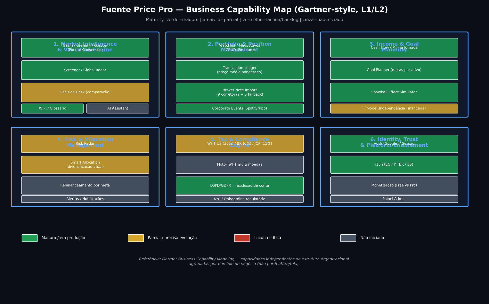
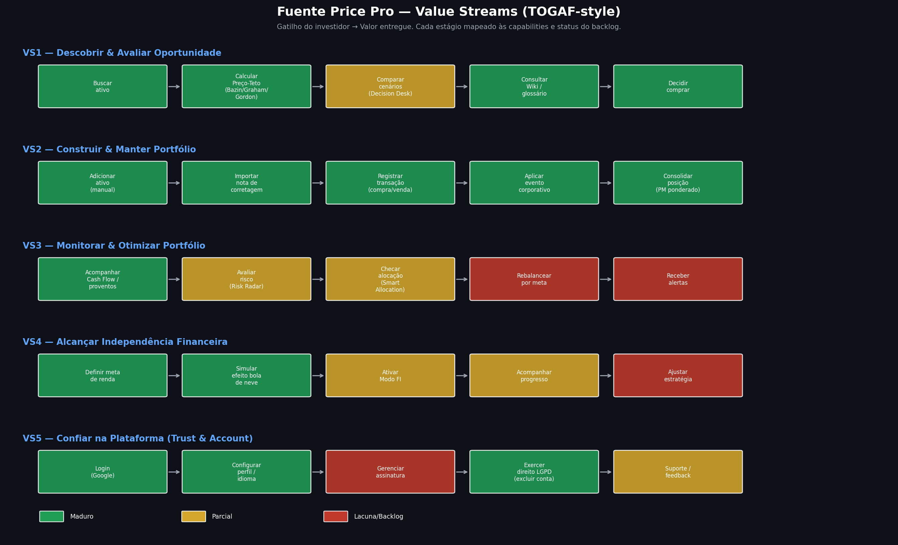
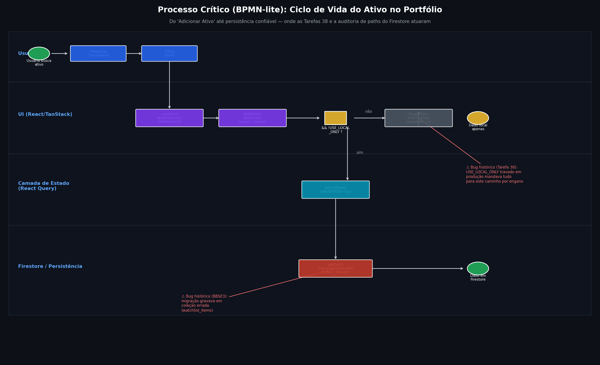
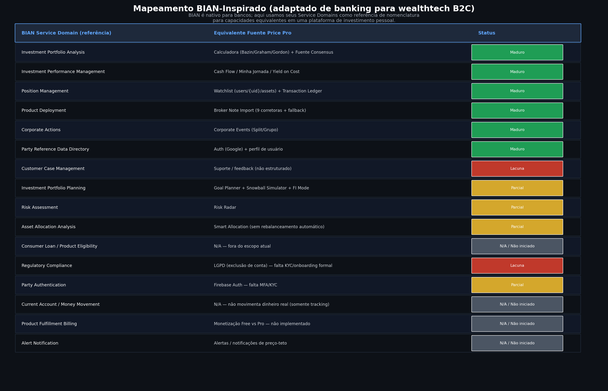
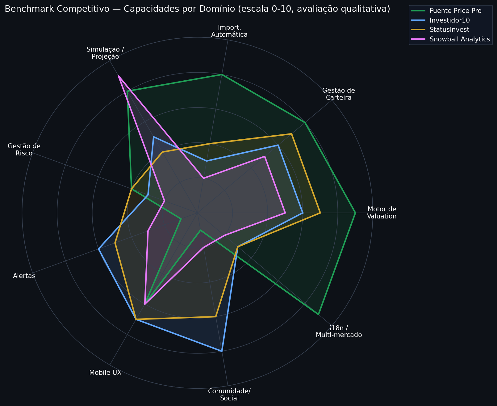

# Fuente Price Pro — Mapeamento de Arquitetura Corporativa

**Frameworks de referência**: TOGAF (Value Streams), Gartner (Business Capability Model), BPMN (processo crítico), BIAN (adaptado — a taxonomia é nativa de banking, usada aqui como vocabulário de referência para uma plataforma de investimento pessoal, não como padrão formal aplicável 1:1).

**Fontes**: código-fonte real (`C:\Users\paulo\OneDrive\Fuente Price Pro`), `PROMPTS_LOG.md`, `BACKLOG_V2.md`, e histórico das 3 sessões de trabalho neste projeto.

---

## 1. Business Capability Map (Gartner-style)

O app foi agrupado em **6 domínios de capacidade** (independentes de tela/feature — uma capability pode estar espalhada em várias telas, ou uma tela pode tocar várias capabilities):

1. **Market Intelligence & Valuation Engine** — o coração do produto (Bazin/Graham/Gordon → Fuente Consensus).
2. **Portfolio & Position Management** — CRUD de ativos, ledger de transações, import de notas, eventos corporativos.
3. **Income & Goal Planning** — Cash Flow, metas, Snowball, Modo FI.
4. **Risk & Allocation Management** — Risk Radar, Smart Allocation, rebalanceamento, alertas.
5. **Tax & Compliance Engine** — WHT, JCP, LGPD, KYC.
6. **Identity, Trust & Platform Enablement** — Auth, i18n, monetização, admin.

**Leitura direta**: os domínios 1 e 2 (o core de valuation e gestão de posição) estão maduros — foi onde a maior parte do esforço das últimas semanas foi investido, e onde os bugs críticos (Tarefa 38, migração Firestore, exclusão de conta) já foram caçados e corrigidos. Os domínios 4, 5 e 6 têm lacunas reais — não é falta de qualidade, é ausência: essas capacidades majoritariamente **não existem ainda**.

---

## 2. Value Streams (TOGAF-style)

Cinco jornadas de valor, do gatilho do investidor até o valor entregue:

- **VS1 — Descobrir & Avaliar**: quase totalmente maduro. Decision Desk é o único elo parcial (histórico de bugs de divergência de cálculo entre telas, já mapeados e corrigidos na maior parte).
- **VS2 — Construir & Manter Portfólio**: 100% maduro. É o value stream mais testado e blindado (Tarefa 38, auditoria de paths, exclusão de conta).
- **VS3 — Monitorar & Otimizar**: aqui está a maior lacuna. Cash Flow está pronto, mas rebalanceamento por meta e alertas — os dois estágios que fecham o ciclo de "otimizar" — não existem.
- **VS4 — Alcançar Independência Financeira**: forte em ferramentas de simulação, mas o "Modo FI" e o acompanhamento contínuo de progresso ainda são parciais.
- **VS5 — Confiar na Plataforma**: Auth e LGPD maduros; monetização é a lacuna mais visível de negócio (não é bug, é ausência de modelo comercial implementado).

---

## 3. Processo Crítico em BPMN-lite: Ciclo de Vida do Ativo

Esse é o processo que concentrou **todos os bugs críticos de perda de dado** encontrados nas últimas sessões:

- O gateway `userId && !USE_LOCAL_ONLY` é o ponto de decisão mais sensível do sistema — foi aqui que a Tarefa 38 travou em produção.
- O caminho de escrita no Firestore (`itemToRow` → `setDoc`) foi onde a auditoria encontrou o path divergente na migração (`watchlist_items` vs `users/{uid}/assets`) que causou a perda "fantasma" do BBSE3.
- Este processo agora tem testes automatizados de regressão e validação comportamental documentada — é hoje o processo mais auditado do sistema. Vale usar esse mesmo rigor como padrão para os próximos processos críticos (ex: fluxo de exclusão de conta, que passou por auditoria similar).

---

## 4. Mapeamento BIAN-Inspirado

BIAN é uma taxonomia de *service domains* para bancos — não existe um "BIAN para wealthtech B2C". Usamos aqui como **vocabulário de referência corporativa**, mapeando cada Service Domain do BIAN ao equivalente mais próximo no Fuente Price Pro. O valor disso não é conformidade formal, é revelar **buracos de nomenclatura que apontam para capacidades ausentes**:

- `Customer Case Management` → não existe hoje um sistema estruturado de suporte/ticket.
- `Alert Notification` → confirmado como lacuna total.
- `Regulatory Compliance` (KYC) → LGPD existe (direito de exclusão), mas onboarding regulatório formal não.
- `Product Fulfillment Billing` → monetização Free/Pro não implementada.

---

## 5. Benchmark Competitivo

Comparação qualitativa (0-10, avaliação estimada com base em pesquisa pública de mercado, não em teste formal) contra Investidor10, StatusInvest e Snowball Analytics — os três benchmarks que você já usa como referência de UX.

**Onde o Fuente Price Pro já lidera**: motor de valuation (múltiplos modelos combinados em consenso é diferencial real), importação automática de notas de corretagem (nenhum concorrente direto oferece isso com a profundidade que você tem — 9 corretoras + fallback), simulação/projeção, e suporte multi-mercado (BR+US) com i18n nativo.

**Onde o mercado está à frente**: alertas (StatusInvest e Investidor10 têm alertas de preço robustos), comunidade/social (Investidor10 tem função social forte), e gestão de risco (ainda incipiente no seu produto vs. concorrentes que têm rating de risco mais elaborado).

---

## 6. Gap Analysis × Backlog — Priorização

| # | Lacuna identificada (Arquitetura) | Item correspondente no Backlog | Impacto no negócio | Prioridade sugerida |
|---|---|---|---|---|
| 1 | Alertas / Notificações (VS3, BIAN `Alert Notification`) | Tarefa 29.2-29.5 (mencionado, sem prompt) | **Alto** — é a lacuna mais visível no benchmark; concorrentes diretos já têm | 🔴 P0 |
| 2 | Rebalanceamento por meta (VS3, capability "Risk & Allocation") | Tarefa 29.2-29.5 | Alto — fecha o ciclo do value stream de otimização | 🔴 P0 |
| 3 | Monetização Free vs Pro (VS5, BIAN `Product Fulfillment Billing`) | Decisão de monetização (registrada, sem prompt) | **Crítico para sustentabilidade do negócio**, não é bug nem UX — é decisão de modelo comercial pendente | 🔴 P0 (decisão, não código) |
| 4 | Motor WHT multi-moedas (Tax & Compliance) | Tarefa 29.2-29.5 | Médio-Alto — afeta precisão para usuários com ativos internacionais diversos | 🟡 P1 |
| 5 | KYC / Onboarding regulatório (Tax & Compliance, BIAN `Regulatory Compliance`) | Tarefa 30 | Médio — relevante se o produto avançar para monetização com dados sensíveis/pagamento | 🟡 P1 |
| 6 | Painel Admin (Identity & Platform) | Tarefa 30 | Médio — necessário para operação e suporte à escala, não bloqueia usuário final | 🟡 P1 |
| 7 | AI Assistant (Market Intelligence) | Tarefa 30 | Médio — diferencial competitivo potencial, mas não crítico agora | 🟢 P2 |
| 8 | Camada 2 — data via nota de corretagem importada | Mencionada, não priorizada | Baixo-Médio — refina precisão de dado já funcional | 🟢 P2 |
| 9 | Tarefa 40 (UX "Investing Since") | ✅ Concluída nesta sessão | — | Concluído |
| 10 | Bug visual: abas do `AssetDetailSheet` quebrando no mobile | Em andamento (regressão `isBargain` bloqueando) | Alto — afeta UX mobile diretamente, mobile é a maioria do tráfego real (conforme vídeo enviado) | 🔴 P0 (retomar imediatamente) |
| 11 | `firestorePaths.ts` — centralização de paths | Backlog, deferida | Médio — dívida técnica que **já causou 2 bugs reais** (migração watchlist, e é candidata a recorrer em outros arquivos) | 🟡 P1 (subiu de prioridade após o histórico de bugs) |

---

## 7. Recomendação de Sequenciamento

Dada a arquitetura mapeada, a leitura estratégica é:

1. **Fechar o bug mobile do `AssetDetailSheet` agora** (já em andamento) — é o único item que bloqueia uma experiência já construída, e mobile é onde o vídeo mostrou o problema acontecendo de verdade.
2. **Decidir o modelo de monetização antes de investir mais em features novas** — arquiteturalmente, capacidades como Alertas, Rebalanceamento e AI Assistant fazem mais sentido desenhadas já sabendo se serão gratuitas, pagas, ou gate de Pro. Construir sem essa decisão arrisca retrabalho.
3. **Alertas + Rebalanceamento por meta** são o par que fecha o Value Stream 3 (Monitorar & Otimizar) — hoje é o value stream mais incompleto e o que mais aparece como lacuna no benchmark competitivo.
4. **`firestorePaths.ts`** deveria subir de prioridade — não é só dívida técnica abstrata, é o padrão de bug que **já se repetiu** (migração da watchlist) e a auditoria mostrou outros pontos hardcoded que são candidatos ao mesmo problema.
5. KYC, Painel Admin e AI Assistant ficam naturalmente depois — dependem da decisão de monetização (#2) para fazer sentido de escopo.

---

*Documento gerado a partir de leitura direta do código-fonte, `PROMPTS_LOG.md`, `BACKLOG_V2.md` e histórico das 3 sessões de trabalho registradas neste projeto.*
