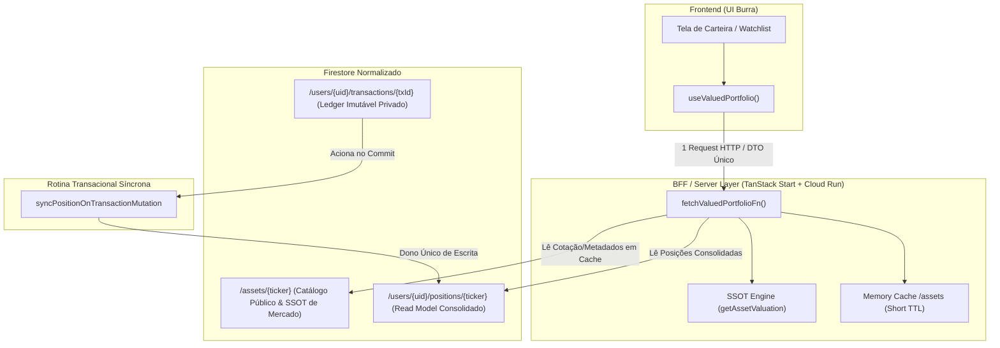

# ADR-001: BFF (Backend for Frontend) e Normalização de Coleções no Firestore

- **Status**: APROVADO
- **Data**: 2026-08-15
- **Decisores**: Paulo Fuentealba, Claude (Arquiteto), Antigravity (Engenharia)
- **Conformidade**: [`AGENTS.md`](file:///C:/Users/paulo/OneDrive/Fuente%20Price%20Pro/docs/AGENTS.md) (Regras 1, 3, 4, 8 e 9)

---

## 1. Contexto e Problema

Na arquitetura legada do Fuente Price Pro, o hook cliente [`useValuedPortfolio`](file:///C:/Users/paulo/OneDrive/Fuente%20Price%20Pro/src/lib/useValuedPortfolio.tsx) atua como um agregador pesado no navegador do usuário:
1. Dispara `useWatchlist()` (leitura de todos os itens do usuário no Firestore).
2. Dispara `useTransactions()` (leitura do histórico bruto de transações no Firestore).
3. Recalcula no cliente a quantidade e o preço médio ponderado (`recalculateHoldingFromTransactions`).
4. Dispara `useLiveQuotesAndMeta(baseItems)` (busca em lote de cotações e metadados).
5. Dispara `useSelic()`, `exchangeRateQueryOptions()`, `macroRatesQueryOptions()` e `ipcaFiveYearAverageQueryOptions()` (4 queries adicionais concorrentes).
6. Itera sobre cada ativo executando o motor de precificação [`getAssetValuation`](file:///C:/Users/paulo/OneDrive/Fuente%20Price%20Pro/src/lib/calculations.ts) no dispositivo móvel/desktop.

### Consequências Negativas Identificadas:
- **Chatty I/O no Mobile**: O cliente dispara até 7 chamadas de rede concorrentes antes do primeiro render completo, causando *layout shift* e latência perceptível em conexões 3G/4G.
- **Custo Excessivo de Leitura no Firestore**: Sem cache centralizado de ativos públicos, cada usuário que possui ativos comuns (ex: `PETR4`, `VALE3`, `HGLG11`) gera leituras redundantes dos mesmos dados cadastrais e cotações.
- **Vazamento de Domínio**: A inteligência de consolidação de carteira reside no estado React do cliente em vez de residir de forma segura e testável no servidor.

---

## 2. Decisão Arquitetural

Adotar uma arquitetura baseada em **BFF (Backend for Frontend) leve** implementado via Server Functions do TanStack Start no mesmo runtime de produção (Cloud Run), acompanhada da **normalização estrita do Firestore** em três coleções com responsabilidades segregadas.



### 2.1 As Três Coleções do Firestore
1. **`/assets/{ticker}` (Catálogo Público & SSOT de Mercado)**:
   - Contém cotações, série histórica de dividendos (5 anos), indicadores fundamentais (EPS, BVPS, ROE, FFO/AFFO, setor) e metadados.
   - Alimentado pelo pipeline de ingestão das fontes de dados (`brapi`, `yahoo`, `nasdaq`, `secEdgar`, `cvm`, `bcb`, `fred`).
   - Leitura pública via BFF; volume de leituras escala por *ativos únicos*, não por *número de usuários*.
2. **`/users/{uid}/transactions/{txId}` (Ledger Privado Imutável)**:
   - Histórico cronológico de compras, vendas, bonificações, desdobramentos e proventos. Permanece como a fonte primária de verdade de custódia.
3. **`/users/{uid}/positions/{ticker}` (Read Model Consolidado)**:
   - Documento derivado contendo `quantity`, `averageCost`, `totalInvested`, `firstBuyDate`, `lastBuyDate`.

---

## 3. Regra Arquitetural Bloqueante: Dono Único de Escrita

> [!IMPORTANT]
> **Regra de Ouro**: A coleção `/users/{uid}/positions/{ticker}` possui **DONO ÚNICO DE ESCRITA**.
> - Toda escrita, atualização ou recálculo de posição é executado exclusivamente pela rotina transacional de mutação de transações (`syncPositionOnTransactionMutation`).
> - É **expressamente proibido** que o cliente frontend, scripts avulsos ou outras rotinas escrevam diretamente em `/users/{uid}/positions`.
> - Toda operação de entrada de transação (importação de notas de corretagem, adição manual, edição ou exclusão de trade) deve obrigatoriamente invocar este ponto único de persistência e recálculo síncrono.

---

## 4. Alternativas Consideradas e Rejeitadas

1. **API Gateway Separado (ex: Kong / Google Cloud Endpoints)**:
   - *Rejeitado*: Introduziria salto de rede adicional e complexidade de infraestrutura/deploy desnecessária, dado que o TanStack Start já roda no Cloud Run com suporte nativo a RPC tipado end-to-end.
2. **GraphQL (Apollo Server / Yoga)**:
   - *Rejeitado*: Adicionaria overhead de parsing de schemas, resolvers e tamanho de bundle para contratos que são conhecidos em tempo de compilação via TypeScript. As server functions do TanStack Start oferecem segurança de tipos superior sem o custo do GraphQL.
3. **Cálculo de Read Model em Tempo Real sem Persistir `/positions`**:
   - *Rejeitado*: Exigiria ler todo o histórico de transações a cada requisição de carteira, degradando a performance para usuários com histórico extenso (centenas de notas de corretagem).

---

## 5. Contrato DTO Completo: `ValuedPortfolioDTO`

```typescript
export interface MoneyDTO {
  amountCents: number; // Em centavos para eliminar erros de precisão em ponto flutuante
  currency: "BRL" | "USD";
}

export interface ValuedPositionDTO {
  ticker: string;
  assetClass: "STOCK_BR" | "FII" | "FII_INFRA" | "FIAGRO" | "STOCK_US" | "REIT" | "ETF" | "FIXED_INCOME";
  quantity: number;
  averageCost: MoneyDTO;
  currentPrice: MoneyDTO;
  marketValue: MoneyDTO;
  valuation: {
    consensus: number | null;
    bazin: number | null;
    graham: number | null;
    gordon: number | null;
    shareholderYield?: number | null;
    affoYield?: number | null;
    bogleModel?: number | null;
    assumptions: Array<{
      key: string;
      label: string;
      helperText: string;
      value: number;
      isCustomized: boolean;
      suggestedRange: { min: number; max: number };
      confidenceBadge: 1 | 2 | 3 | 4;
    }>;
  };
  isSimulationScenario: false; // Regra 4: Simulações nunca consom este DTO salvo
}

export interface ValuedPortfolioDTO {
  userId: string;
  generatedAt: string;          // ISO 8601
  baseCurrency: "BRL" | "USD";  // Moeda configurada pelo usuário
  totalValue: MoneyDTO;
  totalInvested: MoneyDTO;
  totalYieldOnCost: number;     // Percentual consolidado
  positions: ValuedPositionDTO[];
  exchangeRate: {
    pair: "USDBRL";
    rate: number;
    asOf: string;
  };
}
```

---

## 6. Consequências

- **Positivas**:
  - Redução drástica de round-trips no frontend (de 7 para 1 chamada consolidada).
  - Isolamento de regras financeiras no backend.
  - Eliminação de custos de leitura duplicada no Firestore através do cache `/assets`.
- **Mitigações de Risco**:
  - Transição progressiva protegida por Feature Gate (`useFeatureGate("bffValuedPortfolio")`).
  - Manutenção do fallback client-side durante a fase de validação de paridade.
