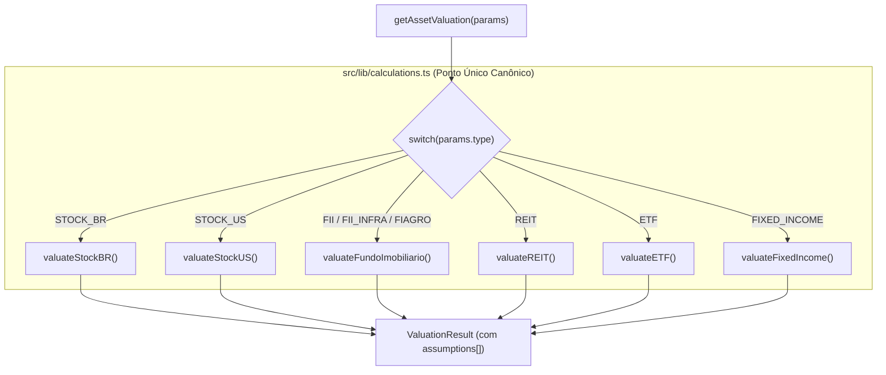

# ADR-002: Dispatcher Canônico de Valuation por Classe de Ativo

- **Status**: APROVADO
- **Data**: 2026-08-15
- **Decisores**: Paulo Fuentealba, Claude (Arquiteto), Antigravity (Engenharia)
- **Conformidade**: [`AGENTS.md`](file:///C:/Users/paulo/OneDrive/Fuente%20Price%20Pro/docs/AGENTS.md) (Regras 1, 2, 4, 8 e 9)

---

## 1. Contexto e Problema

O modelo de precificação do Fuente Price Pro aplicava historicamente Bazin (6% genérico), Graham clássico ($\sqrt{22.5 \cdot LPA \cdot VPA}$) e Gordon H-Model universalmente a todos os ativos. No entanto, no mercado financeiro institucional:
1. **FIIs, Fi-Infra e Fi-Agro**: São condomínios fechados sem LPA/VPA relevantes; sua precificação profissional é ancorada no spread de rendimento sobre o título soberano NTN-B (IPCA+) e Cap Rate do portfólio de imóveis/crédito.
2. **REITs (EUA)**: Divulgam FFO (*Funds From Operations*) e AFFO (*Adjusted FFO*), desconsiderando depreciações contábeis do GAAP; sua precificação depende do AFFO Yield e spread sobre o US Treasury de 10 anos.
3. **Stocks US**: Empresas norte-americanas remuneram acionistas massivamente através de recompra de ações (*Shareholder Yield* = Dividendos + Variação de Float). Ignorar recompras subavalia sistematicamente empresas de alto crescimento.
4. **ETFs**: Cestas indexadas precificadas via Equação de Bogle ($DY + \text{Crescimento de Lucros do Índice}$) e Equity Risk Premium (ERP).

---

## 2. Decisão Arquitetural: Dispatcher Único no SSOT

Conforme a **Regra 4 do `AGENTS.md` (SSOT — Dados Financeiros)**, é **estritamente proibido** criar múltiplos motores de cálculo paralelos (ex: `calculationsBR.ts`, `calculationsUS.ts`, `calculationsFII.ts`). 

Toda a inteligência matemática de precificação reside centralizada dentro de [`src/lib/calculations.ts`](file:///C:/Users/paulo/OneDrive/Fuente%20Price%20Pro/src/lib/calculations.ts), onde o ponto de entrada canônico [`getAssetValuation`](file:///C:/Users/paulo/OneDrive/Fuente%20Price%20Pro/src/lib/calculations.ts) atua como o **Dispatcher por Classe de Ativo**:



---

## 3. Princípio Arquitetural de "Frontend Burro"

> [!IMPORTANT]
> **Regra Não-Negociável**: O frontend é exclusivamente uma camada de apresentação.
> - O backend resolve completamente `label`, `helperText`, `suggestedRange` e `confidenceBadge` (1 a 4) em cada item de `assumptions[]`.
> - O frontend **nunca** calcula valor default, **nunca** decide o perfil/preset, **nunca** infere fórmula e **nunca** calcula score de confiança.
> - O componente de interface realiza apenas um `.map()` sobre o array `assumptions[]` retornado pelo DTO do backend.

---

## 4. Contratos de Tipagem Unificados

```typescript
export interface ValuationAssumption {
  key: string;                                   // Identificador único (ex: 'discountRate', 'ntnBSpread', 'targetYield')
  label: string;                                 // Resolvido em linguagem de resultado no idioma ativo
  helperText: string;                            // Explicativo contextual (ex: "Retorno mínimo exigido acima da NTN-B...")
  value: number;                                 // Valor efetivo aplicado no cálculo
  isCustomized: boolean;                         // True se o investidor sobrescreveu o preset padrão
  suggestedRange: { min: number; max: number };  // Faixa sugerida para sliders na UI
  confidenceBadge: 1 | 2 | 3 | 4;                // Nível de confiabilidade dos dados (●●●○)
}

export interface ValuationResult {
  ticker: string;
  activeCeiling: number | null;
  margin: number | null;
  fuenteConsensus: number | null;
  methods: {
    bazin: number | null;
    graham: number | null;
    gordon: number | null;
    shareholderYield?: number | null;
    affoYield?: number | null;
    bogleModel?: number | null;
  };
  assumptions: ValuationAssumption[];
  investorProfile: "conservative" | "moderate" | "aggressive" | "custom";
}
```

---

## 5. Mediana e Consenso Fuente por Classe

O **Fuente Consensus** para cada classe de ativo é calculado como a mediana estrita dos métodos válidos aplicáveis àquela classe específica:
- **`STOCK_BR`**: Mediana entre Bazin (JCP Líquido), Graham e Gordon 2-Estágios.
- **`STOCK_US`**: Mediana entre Total Shareholder Yield, Gordon Multi-Estágio, FCFE e Peter Lynch Modificado.
- **`FII` / `FII_INFRA` / `FIAGRO`**: Mediana entre Bazin Spread NTN-B, Gordon Inflacionário e Cap Rate Reverso.
- **`REIT`**: Mediana entre AFFO Yield, DDM AFFO, NAV Discount e Spread US Treasury 10Y.
- **`ETF`**: Mediana entre Modelo Bogle, DY Histórico e Equity Risk Premium.

---

## 6. Consequências

- **Consistência Institucional**: Eliminação de anomalias conceituais (ex: aplicar LPA/VPA de ações a fundos imobiliários).
- **Transparência Absoluta**: Fim dos "números mágicos" no código; toda taxa possui rastreabilidade em `assumptions[]`.
- **Manutenibilidade SSOT**: Toda a evolução matemática ocorre em um único arquivo auditável (`src/lib/calculations.ts`).
