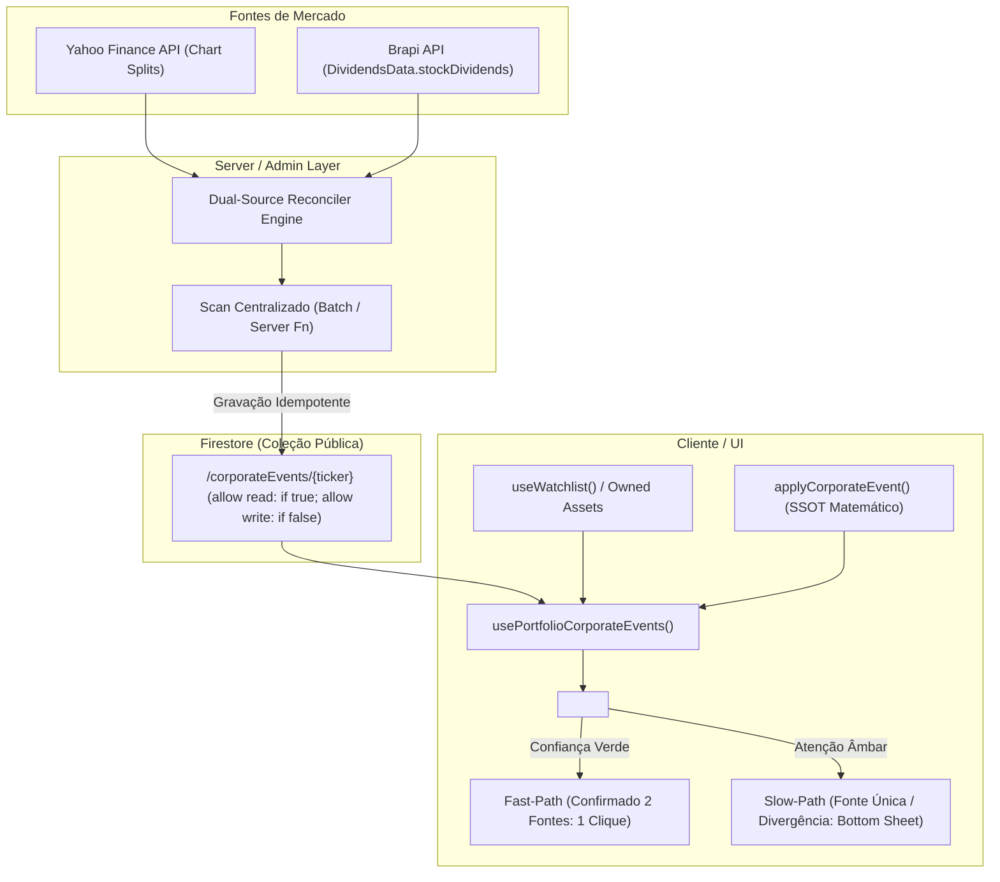

# ADR-003: Automação e Reconciliação Dual-Source de Eventos Corporativos

- **Status**: APROVADO
- **Data**: 2026-09-14
- **Decisores**: Paulo Fuentealba, Claude (Arquiteto), Antigravity (Engenharia)
- **Conformidade**: [`docs/AGENTS.md`](file:///c:/Users/paulo/OneDrive/Fuente%20Price%20Pro/docs/AGENTS.md) (Regras 1, 3, 4, 6, 7, 8 e 9)

---

## 1. Contexto e Problema

Na versão anterior do Fuente Price Pro, a detecção de eventos corporativos (desdobramentos e grupamentos) apresentava três limitações centrais:
1. **Descoberta Reativa e Oculta**: O investidor só descobria a existência de um split se abrisse manualmente a ficha individual daquele ativo (`AssetDetailSheet.tsx`), onde o hook `usePendingEvents(item)` realizava uma consulta isolada.
2. **Dependência de Fonte Única**: A checagem dependia unicamente do Yahoo Finance (`checkPendingSplitsFn`), sem validação cruzada independente de mercado.
3. **Fricção de Aplicação Manual**: Mesmo quando o evento era fato público e notório do mercado, o usuário era obrigado a passar por um modal com múltiplos campos e confirmações manuais redundantes.

---

## 2. Decisão Arquitetural

Adotar uma arquitetura de **descoberta proativa centralizada com reconciliação dual-source (Opção C)** e roteamento de confiança segregado entre **Fast-Path** (1 clique com confirmação) e **Slow-Path** (conferência assistida via Bottom Sheet).



---

## 3. Especificação das Camadas

### 3.1 Fontes e Adaptadores
- **Fonte 1 (Yahoo Finance)**: Cobertura global (B3 e US). Retorna eventos de split com `numerator`, `denominator` e `date`.
- **Fonte 2 (Brapi)**: Cobertura nativa de B3 via `dividendsData.stockDividends`. Retorna `label` (`DESDOBRAMENTO`, `GRUPAMENTO`), `factor` e `lastDatePrior` (Data COM).
- **Tratamento de Bonificação (`bonus`)**: Bonificações não são incorporadas nesta rodada porque exigem custo de aquisição atribuído em AGE para correta apuração de ganho de capital (IRPF), mantendo o escopo focado em `split` e `grouping`.

### 3.2 Motor de Reconciliação Dual-Source
Dois eventos de fontes distintas são reconciliados considerando:
1. **Tipo**: Ambos `split` (fator > 1) ou ambos `grouping` (fator < 1).
2. **Ratio/Fator**: Concordância matemática estrita (`|factor_1 - factor_2| < 0.001`).
3. **Data**: Proximidade temporal de até 5 dias úteis (para acomodar divergência entre Data COM e Data Ex/Liquidação).

**Classificação de Confiança**:
- `confirmed` (Verde): 2 fontes concordam em tipo e fator.
- `single_source` (Âmbar): Apenas 1 fonte reportou o evento (ex: ativo US com Yahoo apenas).
- `divergent` (Âmbar): 2 fontes reportaram dados discordantes para o mesmo período.

### 3.3 Coleção Pública Firestore `/corporateEvents/{ticker}`
- **Regras de Segurança (`firestore.rules`)**:
  ```text
  match /corporateEvents/{ticker} {
    allow read: if true;
    allow write: if false; // Somente Admin SDK
  }
  ```

### 3.4 Experiência do Usuário (UX & Frontend)
1. **Descoberta Proativa**: Banner renderizado no topo da Dashboard (`/app`) e no `MyPortfolio` quando `pendingEvents.length > 0`.
2. **Visualização de Impacto**: Mini-tabela com valores de cotas e preço médio calculados via `applyCorporateEvent()`, com destaque para delta de cotas (`tabular-nums font-mono`).
3. **Ações Segregadas**:
   - **Verde / Confirmado**: Botão "Aplicar ajuste" dispara confirmação rápida inline (1 clique).
   - **Âmbar / Fonte Única**: Botão "Revisar evento" abre o formulário em Bottom Sheet elegante.
