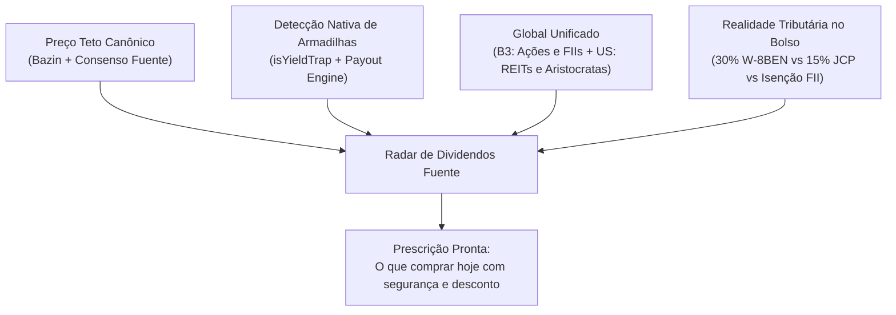

# Radar de Dividendos — Benchmark e Propostas de Arquitetura de Produto

> **Contexto:** Estudo estratégico para a concepção e implementação do **Radar de Dividendos** no Fuente Price Pro, integrando mercado brasileiro (B3) e americano (NYSE/Nasdaq) sob a ótica das diretrizes de arquitetura, design e governança do projeto ([`docs/AGENTS.md`](file:///c:/Users/paulo/OneDrive/Fuente%20Price%20Pro/docs/AGENTS.md)).

---

## 1. Benchmark das Principais Ferramentas (Brasil e EUA)

Para conceber uma experiência verdadeiramente superior no Fuente Price Pro, realizamos uma análise comparativa aprofundada dos players dominantes no Brasil e nos Estados Unidos:

### 🇧🇷 1.1 Ferramentas no Brasil

| Ferramenta | Proposta de Valor | Funcionalidades de Dividendos / Radar | Pontos Fortes | Limitações Críticas |
| :--- | :--- | :--- | :--- | :--- |
| **AGF+ (Ações Garantem o Futuro)** | Metodologia Barsi de acumulação de ações de setores perenes (BESST). | **MADI (Mapa de Ações Dividendos Inteligentes):** cruza DPA projetado / 6% = Preço Teto Bazin, margem de segurança e radar de meses prováveis de anúncio. | Foco cirúrgico em geração de renda passiva; clareza do conceito de "comprar abaixo do teto". | **100% restrito a Ações BR**. Não contempla Fundos Imobiliários (FIIs) e ignora totalmente mercado internacional. Interface proprietária rígida. |
| **Status Invest** | Plataforma quantitativa de triagem e dados de mercado B3 e exterior. | **Agenda de Proventos & Screener:** tabela com datas Com/Pagamento, tipo (Dividendo/JCP), valor por ação e filtro por DY 12m. | Grande volume de dados históricos; busca flexível e dados oficiais da B3/CVM. | **Puramente expositivo (sem tese/preço teto embutido)**. Poluição visual severa (anúncios excessivos); não indica se o dividendo é sustentável ou armadilha de yield. |
| **Investidor10 / Clube FII** | Rankings visuais e calculadoras de renda passiva (Investidor10) e termômetro de rendimentos (Clube FII). | Simulador de renda passiva ("quanto rende R$ X"), ranking de maiores pagadoras nos últimos 12 meses e calendário de emissões. | Visual amigável para o investidor de varejo; forte apelo em FIIs. | Visão retrospectiva (olha o DY passado, caindo em armadilhas de não recorrentes); não cruza com a carteira real do investidor. |
| **GuiaInvest** | Ferramentas de seleção para investidores fundamentalistas. | **Radar de Dividendos:** checklist de 5 critérios (5 anos ininterruptos, lucros crescentes, payout saudável 25%-75%). | Boas regras heurísticas de corte de empresas decadentes. | Sem integração nativa de teto consensual multivariável; ferramentas separadas da custódia. |

---

### 🇺🇸 1.2 Ferramentas nos Estados Unidos

| Ferramenta | Proposta de Valor | Funcionalidades de Dividendos / Radar | Pontos Fortes | Limitações Críticas |
| :--- | :--- | :--- | :--- | :--- |
| **Seeking Alpha** | Hub quantitativo e de research para investidores em Wall Street. | **Dividend Grades & Scorecard:** notas de A+ a F em *Dividend Safety*, *Dividend Growth*, *Dividend Yield* e *Dividend Consistency*. | Padrão-ouro em análise de sustentabilidade de dividendos corporativos americanos; cruza métricas de balanço (EPS vs Cash Flow). | **Custo proibitivo ($239+/ano)**. Não possui Preço Teto Bazin (conceito não utilizado nos EUA); sem suporte à B3 ou realidade tributária brasileira. |
| **Simply Safe Dividends** | Prevenção ativa de cortes de dividendos para aposentados e investidores de renda. | **Dividend Safety Score (1 a 100):** notas em faixas (*Very Safe*, *Safe*, *Borderline*, *Unsafe*). Alerta antecipado de risco de corte de proventos. | Histórico de mais de 20 anos; evitou 98% dos cortes no S&P 500. Foco total em paz de espírito do investidor. | Focado exclusivamente no mercado americano. Foco quase total na segurança e pouco no preço de entrada (valuation). |
| **The Rich / TrackYourDividends** | Acompanhamento mobile e visualização de fluxo de caixa mensal. | **Dividend Wheel & Calendar:** distribuição de proventos ao longo dos 12 meses do ano; tracking de Yield on Cost e DRIP (reinvestimento). | Interface moderna, visualização gráfica de renda mensal intuitiva. | Pouca profundidade de valuation fundamentalista; não filtra armadilhas de yield. |

---

## 2. A Vantagem Competitiva Única do Fuente Price Pro

Nenhum concorrente nacional ou internacional oferece hoje o que o Fuente Price Pro já tem estruturado em seu núcleo:

---

## 3. Avaliação Sob a Ótica dos 12 Papéis ([`docs/AGENTS.md`](file:///c:/Users/paulo/OneDrive/Fuente%20Price%20Pro/docs/AGENTS.md) Regra 9)

Em cumprimento estrito à governança do projeto, analisamos a concepção do Radar de Dividendos sob cada um dos 12 papéis canônicos:

1. **`fuente-architecture-review`**: Exigência de SSOT. O Radar deve consumir a função de valuation canônica (`getAssetValuation`), compartilhando os mesmos cálculos com o Screener e a Watchlist, evitando qualquer bifurcação de fórmulas.
2. **`fuente-solution-architect`**: O Radar precisa de cache inteligente (server-side TTL de 15 a 60 minutos) aproveitando o endpoint precursor `fetchRadarFn` já existente em [`apiService.functions.ts`](file:///c:/Users/paulo/OneDrive/Fuente%20Price%20Pro/src/lib/apiService.functions.ts) para manter latência < 200ms.
3. **`fuente-business-architect`**: O Radar de Dividendos é o maior gatilho de aquisição e conversão para o plano Pro. No plano Free, exibe o radar dos ativos da watchlist do usuário ou top 5 do mercado; no plano Pro, monitoramento irrestrito de mais de 100 ativos BR/US, alertas de Data Com e filtros avançados.
4. **`fuente-product-manager`**: O Job-To-Be-Done principal é: *"No dia do meu aporte mensal, me diga em 10 segundos quais são as 3 melhores oportunidades seguras para colocar meu dinheiro"*.
5. **`fuente-product-marketing`**: Posicionamento antagônico de alto valor: *"O AGF+ é fechado e só olha ações do Brasil; o Status Invest é uma planilha cheia de propagandas. O Fuente Price Pro une o Preço Teto Bazin, segurança contra cortes e ativos globais (B3 + EUA) sem ruído"*.
6. **`fuente-ux-designer`**: Abordagem Mobile-First estrita. O investidor costuma checar o radar no smartphone enquanto decide a ordem na corretora. Layout baseado em cartões inteligentes ou tabelas horizontais suaves.
7. **`fuente-investidor-profissional`**: Exige densidade e auditabilidade. Quer ver o Payout sobre fluxo de caixa livre (não apenas contábil), CAGR de dividendos de 5 anos, histórico de corte e exportação limpa para CSV.
8. **`fuente-investidor-iniciante`**: Não pode entrar em pânico com termos técnicos. Precisa de vereditos claros: *"Barato (Abaixo do Teto)"*, *"Dividendo Seguro"*, *"Anúncio Previsto em X dias"*.
9. **`fuente-advogado-lgpd-gdpr`**: Disclaimer regulatório CVM/SEC explícito e visível: *"O Radar de Dividendos é uma ferramenta analítica de triagem matemática baseada em dados públicos e não constitui recomendação de investimento"*.
10. **`fuente-copywriter-financeiro`**: Copy sóbrio, elegante, sofisticado, sem promessas milagrosas de enriquecimento rápido.
11. **`fuente-frontend-designer`**: Uso rigoroso do design system (Fraunces nos números/títulos nobres, JetBrains Mono nos dados monetários, Space Grotesk nos labels de apoio e micro-interações refinadas).
12. **`fuente-tributarista-br-us`**: O investidor deve enxergar o **Yield Líquido Real**: já descontando a retenção na fonte de 30% em dividendos americanos (W-8BEN) e 15% de IR sobre JCP no Brasil.

---

## 4. As Três Propostas de Solução

Criamos 3 propostas conceituais completas, todas prototipadas interativamente em código HTML real no arquivo:  
📂 [`docs/design/prototypes/radar-dividendos-propostas.html`](file:///c:/Users/paulo/OneDrive/Fuente%20Price%20Pro/docs/design/prototypes/radar-dividendos-propostas.html)

---

### 🟢 PROPOSTA 1: "Radar Tático de Oportunidades & Margem Bazin"
> **Foco:** O Momento do Aporte (Onde colocar meu dinheiro hoje?)

- **Descrição:** Um scanner direto ao ponto para o investidor focado em acumulação. Varre o universo de ativos monitorados e filtra apenas aqueles cuja cotação atual está **abaixo do Preço Teto Bazin**, descartando automaticamente qualquer ativo com sinal de armadilha de yield (`isYieldTrap: true`).
- **Principais Componentes de Tela:**
  - **KPIs de Destaque:** Ativos em Zona de Compra, Margem Média de Segurança (+16,4%), Yield Médio do Radar (8,92%), Armadilhas Descartadas (3 ativos).
  - **Filtros por Segmentos:** `[ Todos ] [ Ações B3 ] [ FIIs ] [ Dividend Aristocrats US ] [ REITs ]`.
  - **Tabela Tática Inteligente:** Ticker, Preço Atual, Preço Teto Bazin, Margem de Segurança (+%), DY 12m, Payout, Score de Sustentabilidade e Botão "+ Aportar".
- **Vantagens:**
  - Baixo esforço de implementação (reutiliza mais de 80% dos componentes e seletores já existentes no Screener).
  - Resposta cognitiva instantânea (< 3 segundos) para o investidor iniciante e intermediário.
- **Limitações:**
  - Não aborda a previsão temporal das datas de corte (Data Com).

---

### 📅 PROPOSTA 2: "Mapa Preditivo de Sazonalidade & Data Com"
> **Foco:** Previsibilidade do Calendário & Cobertura de Meses Fracos

- **Descrição:** Inspirado no MADI do AGF+ e no The Rich, foca na **previsibilidade temporal**. Mapeia os 12 meses do ano e indica quais empresas historicamente anunciam ou pagam proventos em cada mês. Cruza esses dados com a carteira do usuário para sugerir compras que preencham os "meses fracos" de renda.
- **Principais Componentes de Tela:**
  - **Card de Insight Preditivo:** *"Sua carteira tem baixa renda em Maio e Novembro. Os ativos TAEE11 e TRPL4 cobrem perfeitamente esses meses, têm histórico 5/5 anos e estão abaixo do teto hoje"*.
  - **Seletor Visual de Meses:** Linha horizontal de Jan a Dez com contagem de ativos por mês e badge de destaque para o mês atual e próximo.
  - **Tabela de Proventos Previstos:** Ativo, Consistência Histórica (ex: 5 de 5 anos), Janela Estimada de Data Com, Janela de Pagamento, Preço Atual vs Teto e Valor Estimado por Cota.
- **Vantagens:**
  - Ajuda o investidor a construir o tão sonhado "fluxo de dividendos uniforme todo mês".
  - Apelo emocional fortíssimo para quem segue a estratégia de Barsi/renda previdenciária.
- **Limitações:**
  - Depende de base histórica de datas de corte e inteligência de sazonalidade mais sofisticada.

---

### 💎 PROPOSTA 3: "Radar 360° Dividend Health, Safety & Growth" (Recomendada)
> **Foco:** O Hub Definitivo (Seeking Alpha + Bazin Global + Calendário)

- **Descrição:** A solução mais completa, robusta e com maior poder de conversão para o plano Pro. Combina o melhor das Propostas 1 e 2 em uma interface moderna com abas ou modos de exibição adaptáveis.
- **Principais Componentes de Tela:**
  - **Navegação em Abas Temáticas:**
    1. `💎 Reis dos Dividendos (DGI)`: Empresas com histórico de crescimento ininterrupto de proventos (Dividend Aristocrats nos EUA e consistência B3).
    2. `🟢 Oportunidades < Teto`: Scanner de ativos em zona de compra com margem de segurança atrativa.
    3. `📅 Próximos Pagamentos & Datas Com`: Calendário dos próximos 30/60 dias.
    4. `⚠️ Alertas de Risco`: Radar preventivo de possíveis cortes de dividendos e payouts perigosos.
  - **Alternância de Visualização:**
    - **Modo Cards Visuais** (Iniciante): Cards resumidos com Score de Segurança (0 a 100), destaque para Preço Teto, Margem e status amigável.
    - **Modo Tabela Densa** (Profissional): Mais de 10 colunas, ordenação múltipla e exportação para CSV/Excel.
  - **Filtro Global Inteligente:** Permite alternar entre Brasil (B3), Estados Unidos (USD) ou Consolidado Global.

---

## 5. Matriz Comparativa das 3 Abordagens

| Critério de Avaliação | Proposta 1: Radar Tático Bazin | Proposta 2: Mapa Sazonalidade | Proposta 3: Radar 360° Safety & Growth |
| :--- | :--- | :--- | :--- |
| **Principal Objetivo** | Momento de Aporte (onde colocar dinheiro hoje) | Previsibilidade (garantir a próxima Data Com) | Hub Completo de Renda (preço, qualidade e data) |
| **Régua de Benchmark** | Status Invest + Bazin Puro | AGF+ (MADI) + TrackYourDividends | Seeking Alpha + Simply Safe Dividends + Bazin |
| **Experiência Iniciante** | ⭐⭐⭐⭐ (Direto, fácil de entender) | ⭐⭐⭐ (Intuitivo pelo calendário) | ⭐⭐⭐⭐⭐ (Cards visuais mastigados + scores claros) |
| **Experiência Profissional** | ⭐⭐⭐ (Faltam métricas de balanço) | ⭐⭐⭐ (Bom para arbitragem de data com) | ⭐⭐⭐⭐⭐ (Rigor institucional, auditoria, tabela pro) |
| **Poder de Conversão Pro** | Médio (Alertas de oportunidade abaixo do teto) | Médio (Acesso ao calendário preditivo) | **Altíssimo** (Safety Scores exclusivos e análise 360°) |
| **Esforço de Implementação** | **Baixo (1 a 2 sessões)** | Médio (2 a 3 sessões) | Médio/Alto (Evolutivo em 2 fases) |
| **Reuso de Código Existente** | 85% do Screener e Valuation Engine | 70% do motor de cashflow / income | 75% dos componentes existentes + layout novo |

---

## 6. Onde o Radar de Dividendos Deve Viver no App?

Existem duas alternativas arquiteturais para a rota do Radar:

1. **Opção Integrada em `/app/explore` (Aba Dedicada):**
   - Na tela de **Explorar Ativos**, adicionar a aba `Radar de Dividendos`:  
     `[ Raio-X ] [ Screener ] [ Comparador ] [ Radar de Dividendos ] [ Radar de Risco ] [ Bola de Neve ]`
   - *Vantagem:* Mantém o Hub de Descoberta e Análise centralizado em uma única rota já conhecida do usuário.

2. **Opção de Rota Própria de Primeiro Nível (`/app/dividend-radar`):**
   - Entrada direta no menu lateral sob a seção **"Mercado & Análise"** com ícone de radar/alvo (ex: `Target` ou `Radar`).
   - *Vantagem:* Dá destaque máximo à feature, elevando o valor percebido do produto para investidores focados em dividendos.

---

## 7. Recomendação Estratégica & Roadmap em Fases

Recomendamos seguir com a **Proposta 3 em 2 fases evolutivas**:

- **Fase 1 (MVP de Alto Impacto):**
  - Implementar a Proposta 1 (Radar Tático de Oportunidades & Margem Bazin com visualização em Tabela e Cards) na rota dedicada ou aba do Explore.
  - Oferece valor imediato no próximo ciclo de aportes do usuário.
- **Fase 2 (Diferencial Competitivo):**
  - Adicionar o Mapa de Sazonalidade / Datas Com Previstas (Proposta 2) e o Score de Segurança de Proventos 0-100 (Proposta 3).

---

> 🔗 **Para interagir com as 3 propostas:** abra o protótipo local interativo em [`docs/design/prototypes/radar-dividendos-propostas.html`](file:///c:/Users/paulo/OneDrive/Fuente%20Price%20Pro/docs/design/prototypes/radar-dividendos-propostas.html).
